# FSAD-SEE
Below is a **complete exam-oriented 20-mark answer for UNIT–I** of **Full Stack Application Development**, prepared strictly according to your instructions.

---

# **UNIT – I: INTRODUCTION TO FULL STACK DEVELOPMENT AND MERN STACK**

---

## **1. Introduction to Full Stack Development**

### **Definition**

Full Stack Development refers to the process of designing, developing, and maintaining **both the front-end and back-end parts** of a web application along with database and deployment.

A Full Stack Developer works on:

* User Interface (UI)
* Server-side logic
* Database management
* Deployment and maintenance

---

### **Components of Full Stack Development**

A full stack application consists of **three main layers**:

#### 1. Front-End (Client Side)

* Runs in the user’s browser
* Responsible for UI and interaction
* Technologies used:

  * HTML
  * CSS
  * JavaScript
  * React.js

#### 2. Back-End (Server Side)

* Handles business logic
* Processes requests
* Connects to database
* Technologies used:

  * Node.js
  * Express.js
  * Java
  * Python

#### 3. Database Layer

* Stores application data
* Manages records
* Technologies used:

  * MongoDB
  * MySQL
  * PostgreSQL

---

### **Architecture of Full Stack Application**

```
User (Browser)
      ↓
Front-End (React)
      ↓
Back-End (Node + Express)
      ↓
Database (MongoDB)
```

---

### **Technologies Associated with Full Stack**

| Layer           | Technology                   |
| --------------- | ---------------------------- |
| Front-End       | HTML, CSS, JavaScript, React |
| Back-End        | Node.js, Express             |
| Database        | MongoDB                      |
| Version Control | Git                          |
| Hosting         | AWS, Netlify                 |

---

### **Advantages of Full Stack Development**

1. Complete control over application
2. Faster development
3. Cost-effective
4. Easy maintenance
5. Better understanding of system

---

### **Applications**

* E-commerce websites
* Social media platforms
* Banking systems
* Learning management systems
* Online portals

---

## **2. Introduction to MERN Stack**

### **Definition**

MERN Stack is a popular JavaScript-based technology stack used for building full stack web applications.

MERN stands for:

| Letter | Technology |
| ------ | ---------- |
| M      | MongoDB    |
| E      | Express.js |
| R      | React.js   |
| N      | Node.js    |

---

### **Architecture of MERN Stack**

```
Browser (React)
      ↓
Express Server
      ↓
Node.js Runtime
      ↓
MongoDB Database
```

---

### **Components of MERN Stack**

#### 1. MongoDB

* NoSQL database
* Stores data in JSON-like format
* Uses collections and documents

#### 2. Express.js

* Web framework for Node.js
* Handles routing and middleware

#### 3. React.js

* Front-end library
* Used to build UI components

#### 4. Node.js

* JavaScript runtime
* Runs JavaScript on server

---

### **Advantages of MERN Stack**

1. Uses single language (JavaScript)
2. Fast development
3. Open source
4. Scalable
5. High performance

---

## **3. MVC Architectural Pattern**

### **Definition**

MVC stands for **Model–View–Controller**.
It is a design pattern used to separate application logic.

---

### **Components of MVC**

#### 1. Model

* Handles data
* Communicates with database
* Contains business logic

#### 2. View

* Displays UI
* Shows data to user

#### 3. Controller

* Controls application flow
* Connects Model and View

---

### **MVC Architecture Diagram**

```
User
 ↓
View  ←→ Controller ←→ Model ←→ Database
```

---

### **Advantages of MVC**

1. Separation of concerns
2. Easy maintenance
3. Reusable code
4. Better testing

---

### **Application in MERN**

* Model → MongoDB + Mongoose
* View → React
* Controller → Express Routes

---

## **4. Introduction to Node.js**

### **Definition**

Node.js is an open-source, server-side JavaScript runtime environment used to build scalable network applications.

---

### **Features of Node.js**

1. Event-driven
2. Non-blocking I/O
3. Single-threaded
4. High performance
5. Asynchronous execution

---

### **Event-Driven Programming**

Node.js works on events.

Example:

* User request = Event
* Server response = Event handler

```
Request → Event → Handler → Response
```

---

### **JavaScript Closures in Node.js**

#### Definition

A closure is a function that remembers its outer variables.

#### Example

```javascript
function outer() {
  let count = 0;
  return function inner() {
    count++;
    return count;
  }
}
```

Closures help in:

* Data privacy
* Memory management

---

### **Node.js Modules**

#### Definition

Modules are reusable blocks of code.

---

#### Types of Modules

##### 1. Core Modules

Built-in modules

Examples:

* fs
* http
* path
* os

##### 2. Local Modules

User-defined modules

##### 3. Third-Party Modules

Installed using npm

Example:

* express
* mongoose

---

### **CommonJS Modules**

Uses `require()` and `module.exports`

Example:

```javascript
const math = require('./math');
module.exports = add;
```

---

### **Node.js File Modules**

Used to handle files

Example:

```javascript
const fs = require('fs');
fs.readFile('data.txt');
```

Functions:

* readFile()
* writeFile()
* appendFile()
* delete()

---

## **5. Developing Node.js Web Application**

### **Steps**

1. Install Node.js
2. Create project folder
3. Initialize npm
4. Install packages
5. Create server
6. Run application

---

### **npm Initialization**

```
npm init
```

Creates `package.json`

---

### **Basic Server Example**

```javascript
const http = require('http');

http.createServer((req,res)=>{
 res.write("Hello World");
 res.end();
}).listen(3000);
```

---

## **6. Middleware in Node.js**

### **Definition**

Middleware is a function that executes between request and response.

---

### **Flow of Middleware**

```
Request → Middleware → Route → Response
```

---

### **Types of Middleware**

1. Application-level
2. Router-level
3. Error-handling
4. Built-in
5. Third-party

---

### **Example**

```javascript
app.use((req,res,next)=>{
 console.log("Middleware");
 next();
});
```

---

## **7. Introduction to Express.js**

### **Definition**

Express.js is a lightweight web framework for Node.js used to create APIs and web applications.

---

### **Features**

1. Routing
2. Middleware support
3. Fast server
4. REST API creation
5. Template engines

---

### **Installing Express**

```
npm install express
```

---

### **Creating Express App**

```javascript
const express = require('express');
const app = express();
```

---

## **8. Express Application Structure**

### **Main Components**

1. Application Object
2. Request Object
3. Response Object
4. Router
5. Middleware

---

### **Application Object**

```javascript
const app = express();
```

Controls server.

---

### **Request Object (req)**

Contains:

* URL
* Headers
* Body
* Parameters

Example:

```javascript
req.params
req.body
```

---

### **Response Object (res)**

Used to send response

Example:

```javascript
res.send("Hello");
res.json(data);
```

---

## **9. External Middleware**

### **Definition**

External middleware are third-party packages used for extra features.

---

### **Examples**

| Middleware  | Purpose             |
| ----------- | ------------------- |
| body-parser | Parse request body  |
| cors        | Enable cross-origin |
| morgan      | Logging             |
| helmet      | Security            |

---

### **Example**

```javascript
const bodyParser = require('body-parser');
app.use(bodyParser.json());
```

---

## **10. Advantages of Using Express and Node.js**

1. High speed
2. Scalability
3. Lightweight
4. Real-time support
5. Easy API creation
6. Large community
7. Cross-platform

---

## **11. Practical Applications of Unit–I Concepts**

1. REST API development
2. E-commerce backend
3. Authentication systems
4. Chat applications
5. Blog platforms
6. Management systems

---

UNIT-2

Below is a **complete exam-oriented 20-mark answer for UNIT–II** of **Full Stack Application Development**, prepared strictly according to your instructions.

---

# **UNIT – II: UNDERSTANDING REACT AND WEB SERVER & REACT STATE**

---

## **1. Introduction to React and Web Server**

### **Definition**

React is an open-source JavaScript library used for building **interactive and dynamic user interfaces** for web applications.

A Web Server is a system that receives requests from clients (browsers) and sends web pages or data as responses.

In MERN stack:

* React works on the client side
* Node.js + Express works as the web server

---

### **Role of React in Full Stack Development**

React is used to:

1. Create dynamic UI
2. Update pages without reload
3. Improve user experience
4. Manage application components
5. Communicate with backend APIs

---

### **Client–Server Architecture**

```
Browser (React)
      ↓ Request
Web Server (Node + Express)
      ↓
Database (MongoDB)
      ↑
   Response
```

---

## **2. Server Setup for React Application**

### **Definition**

Server setup refers to the configuration of tools and environment required to run React applications and backend services.

---

### **Steps for Server Setup**

#### Step 1: Install Node.js

Node.js must be installed to run React.

Check version:

```
node -v
npm -v
```

---

#### Step 2: Install React App Tool

```
npx create-react-app myapp
```

Creates a React project.

---

#### Step 3: Start Development Server

```
cd myapp
npm start
```

Runs server on:

```
http://localhost:3000
```

---

### **Folder Structure of React App**

```
myapp/
 ├── node_modules
 ├── public
 ├── src
 │   ├── App.js
 │   ├── index.js
 │   └── components
 └── package.json
```

---

## **3. NVM (Node Version Manager)**

### **Definition**

NVM is a tool used to install and manage multiple versions of Node.js on a single system.

---

### **Features of NVM**

1. Switch between versions
2. Install old/new versions
3. Manage projects easily
4. Avoid compatibility issues

---

### **Commands**

Install Node version:

```
nvm install 16
```

Use version:

```
nvm use 16
```

List versions:

```
nvm list
```

---

## **4. Node.js, NPM, and Express in React Environment**

---

### **Node.js**

* Runs JavaScript on server
* Manages backend
* Supports API creation

---

### **NPM (Node Package Manager)**

#### Definition

NPM is used to install and manage libraries in Node.js projects.

---

#### Functions of NPM

1. Install packages
2. Update packages
3. Remove packages
4. Maintain dependencies

---

#### Example

```
npm install axios
```

---

### **Express.js**

Used to create backend APIs.

Example:

```javascript
const express = require('express');
const app = express();

app.get('/',(req,res)=>{
  res.send("Hello");
});
```

---

## **5. Build-Time JSX Compilation**

### **Definition**

JSX is a syntax extension that allows writing HTML inside JavaScript.

Before execution, JSX is converted into JavaScript.

This process is called **JSX Compilation**.

---

### **JSX Example**

```javascript
const element = <h1>Hello</h1>;
```

Converted to:

```javascript
React.createElement("h1",null,"Hello");
```

---

### **Compilation Process**

```
JSX → Babel → JavaScript → Browser
```

---

### **Role of Babel**

Babel is a compiler that converts modern JavaScript and JSX into browser-compatible code.

---

## **6. Separate Script File, Transform, and Automate**

---

### **Separate Script File**

React uses separate JavaScript files for components.

Example:

```
Header.js
Footer.js
```

---

### **Transform**

Transform means converting modern code into old compatible code.

Done using:

* Babel
* Webpack

---

### **Automate**

Automation means automatically compiling, bundling, and refreshing code.

Tools used:

* Webpack
* Create React App
* Vite

---

### **Benefits**

1. Faster development
2. Less manual work
3. Error detection
4. Automatic reload

---

## **7. React Library**

### **Definition**

React library provides functions and tools for building UI components.

---

### **Main Features**

1. Virtual DOM
2. Component-based
3. Reusable code
4. Fast rendering
5. One-way data binding

---

### **Virtual DOM**

Virtual DOM is a lightweight copy of real DOM.

```
Change → Virtual DOM → Compare → Update Real DOM
```

Improves performance.

---

## **8. React Components**

### **Definition**

Components are independent and reusable blocks of UI.

---

### **Types of Components**

#### 1. Class Components

```javascript
class Welcome extends React.Component {
 render() {
  return <h1>Hello</h1>;
 }
}
```

---

#### 2. Functional Components

```javascript
function Welcome() {
 return <h1>Hello</h1>;
}
```

---

### **Advantages of Components**

1. Reusability
2. Easy maintenance
3. Modular structure
4. Readable code

---

## **9. Composing Components**

### **Definition**

Composing means combining multiple components into one.

---

### **Example**

```javascript
function App() {
 return (
  <Header/>
  <Content/>
  <Footer/>
 );
}
```

---

### **Benefits**

1. Better structure
2. Easy management
3. Clean design

---

## **10. Passing Data Using Properties (Props)**

### **Definition**

Props are used to pass data from parent to child components.

---

### **Example**

```javascript
function Student(props) {
 return <h1>{props.name}</h1>;
}

<Student name="Rahul"/>
```

---

### **Characteristics of Props**

1. Read-only
2. Immutable
3. One-way data flow
4. Used for communication

---

## **11. Property Validation**

### **Definition**

Property validation ensures correct type of data is passed.

---

### **Using PropTypes**

```javascript
Student.propTypes = {
 name: PropTypes.string
};
```

---

### **Benefits**

1. Avoid errors
2. Improve reliability
3. Debugging support

---

## **12. Using Children in React**

### **Definition**

Children allow passing components inside components.

---

### **Example**

```javascript
function Box(props) {
 return <div>{props.children}</div>;
}
```

---

### **Usage**

Used in:

* Layouts
* Containers
* Wrappers

---

## **13. Dynamic Composition**

### **Definition**

Dynamic composition means creating components at runtime based on data.

---

### **Example**

```javascript
items.map(item => <List data={item}/>)
```

---

### **Advantages**

1. Flexible UI
2. Dynamic rendering
3. Data-driven design

---

## **14. Understanding React State**

### **Definition**

State is an object that stores dynamic data of a component.

---

### **Example**

```javascript
const [count,setCount] = useState(0);
```

---

### **Characteristics of State**

1. Mutable
2. Local to component
3. Triggers re-render
4. Manages data

---

## **15. Setting State**

### **Using useState Hook**

```javascript
const [name,setName] = useState("Ram");
```

---

### **Updating State**

```javascript
setName("Shyam");
```

---

### **Rules**

1. Do not modify directly
2. Use setter function
3. Updates are asynchronous

---

## **16. Event Handling in React**

### **Definition**

Event handling allows responding to user actions.

---

### **Example**

```javascript
<button onClick={handleClick}>Click</button>
```

---

### **Common Events**

| Event    | Purpose      |
| -------- | ------------ |
| onClick  | Mouse click  |
| onChange | Input change |
| onSubmit | Form submit  |

---

## **17. Communication from Child to Parent**

### **Definition**

Child-to-parent communication is done using callback functions.

---

### **Example**

```javascript
function Parent() {
 function getData(data){
  console.log(data);
 }

 return <Child send={getData}/>;
}
```

---

## **18. Stateless Components**

### **Definition**

Stateless components do not maintain state.

They depend only on props.

---

### **Example**

```javascript
function Hello(props){
 return <h1>{props.name}</h1>;
}
```

---

### **Advantages**

1. Simple
2. Fast
3. Easy testing
4. Less memory

---

## **19. Designing Components: State vs Props**

| Feature    | State        | Props         |
| ---------- | ------------ | ------------- |
| Modifiable | Yes          | No            |
| Scope      | Local        | Global        |
| Purpose    | Dynamic data | Communication |
| Control    | Component    | Parent        |

---

## **20. Component Hierarchy Communication**

### **Definition**

Component hierarchy refers to parent-child relationships.

---

### **Types**

1. Parent → Child (Props)
2. Child → Parent (Callback)
3. Sibling (Common parent)

---

### **Diagram**

```
App
 ↓
Parent
 ↓
Child
```

---

## **21. Applications of Unit–II Concepts**

1. Form handling
2. Dashboard UI
3. Admin panels
4. User profiles
5. Dynamic pages
6. SPA applications

---
Below is a **complete exam-oriented 20-mark answer for UNIT–IV** of **Full Stack Application Development**, prepared strictly according to your instructions, with **diagrams in Mermaid syntax**.

---

# **UNIT – IV: BUILDING RESTFUL APIs AND MONGODB INTEGRATION**

---

## **1. Introduction to RESTful Web Services**

### **Definition**

REST stands for **Representational State Transfer**.

REST is an architectural style used to design web services that allow communication between client and server using HTTP protocols.

A RESTful API is an API that follows REST principles.

---

### **Features of REST Architecture**

1. Client–Server based
2. Stateless communication
3. Resource-based system
4. Uses HTTP methods
5. Supports multiple formats (JSON, XML)

---

### **REST Architecture Diagram (Mermaid)**

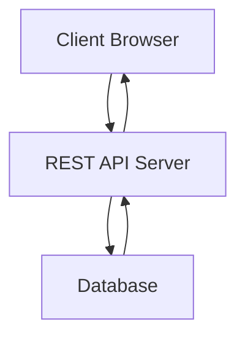

---

### **Advantages of REST**

1. Simple to use
2. Platform independent
3. Scalable
4. Lightweight
5. High performance

---

## **2. HTTP Methods as Actions**

### **Definition**

HTTP methods are used to perform different actions on server resources.

Each method represents a specific operation.

---

### **Common HTTP Methods**

| Method | Action | Description  |
| ------ | ------ | ------------ |
| GET    | Read   | Fetch data   |
| POST   | Create | Insert data  |
| PUT    | Update | Replace data |
| PATCH  | Update | Modify part  |
| DELETE | Delete | Remove data  |

---

### **Example**

```javascript
app.get('/users',(req,res)=>{
 res.send("Get Users");
});
```

---

### **HTTP Request Flow (Mermaid)**

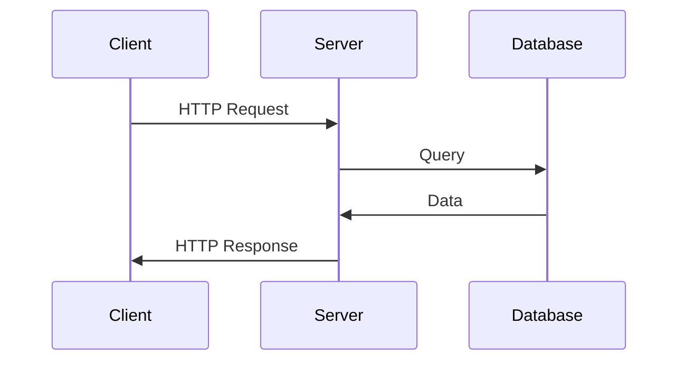

---

## **3. Understanding JSON**

### **Definition**

JSON (JavaScript Object Notation) is a lightweight data-interchange format used to exchange data between client and server.

---

### **Features of JSON**

1. Easy to read
2. Lightweight
3. Language independent
4. Fast parsing
5. Supports arrays and objects

---

### **JSON Example**

```json
{
 "id":101,
 "name":"Rahul",
 "course":"MCA"
}
```

---

### **Role of JSON in REST APIs**

* Sends request data
* Receives response data
* Stores structured information

---

## **4. Introduction to Express for API Development**

### **Definition**

Express.js is a Node.js framework used to create REST APIs easily.

It handles routing, middleware, and HTTP requests.

---

### **Features of Express**

1. Simple routing
2. Middleware support
3. High speed
4. REST support
5. Error handling

---

### **Installing Express**

```
npm install express
```

---

### **Creating Server**

```javascript
const express = require('express');
const app = express();

app.listen(3000);
```

---

## **5. Routing Handler Functions**

### **Definition**

Routing handlers are functions that handle client requests for specific URLs.

---

### **Syntax**

```javascript
app.METHOD(PATH, HANDLER)
```

---

### **Example**

```javascript
app.get('/home',(req,res)=>{
 res.send("Home Page");
});
```

---

### **Routing Structure (Mermaid)**

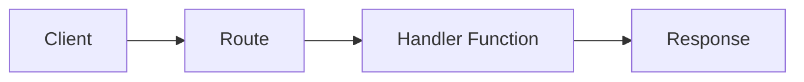

---

## **6. Request Object in Express (req)**

### **Definition**

The request object contains information sent by the client.

---

### **Properties of req Object**

| Property    | Purpose        |
| ----------- | -------------- |
| req.body    | Form data      |
| req.params  | URL parameters |
| req.query   | Query strings  |
| req.headers | Header info    |

---

### **Example**

```javascript
app.post('/login',(req,res)=>{
 console.log(req.body);
});
```

---

## **7. Response Object in Express (res)**

### **Definition**

The response object is used to send data from server to client.

---

### **Common Methods**

| Method         | Purpose    |
| -------------- | ---------- |
| res.send()     | Send text  |
| res.json()     | Send JSON  |
| res.status()   | Set status |
| res.redirect() | Redirect   |

---

### **Example**

```javascript
res.status(200).json({msg:"Success"});
```

---

## **8. Middleware in REST APIs**

### **Definition**

Middleware is a function executed between request and response.

---

### **Middleware Flow (Mermaid)**

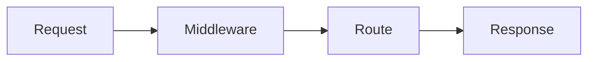

---

### **Types of Middleware**

1. Application-level
2. Router-level
3. Built-in
4. Third-party
5. Error-handling

---

### **Example**

```javascript
app.use(express.json());
```

---

## **9. Creating RESTful APIs**

### **Definition**

Creating REST APIs means developing endpoints for CRUD operations using HTTP methods.

---

### **Basic API Structure**

```javascript
app.get()
app.post()
app.put()
app.delete()
```

---

### **Example API**

```javascript
app.post('/student',(req,res)=>{
 res.send("Student Added");
});
```

---

## **10. LIST API (GET Operation)**

### **Definition**

LIST API is used to retrieve all records from database.

Uses GET method.

---

### **Example**

```javascript
app.get('/students',async(req,res)=>{
 const data = await Student.find();
 res.json(data);
});
```

---

### **List API Flow (Mermaid)**

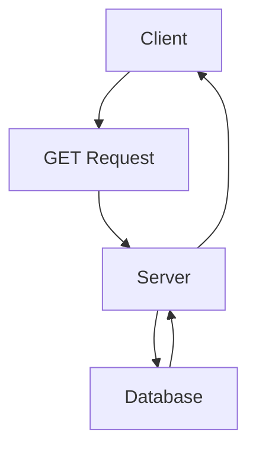

---

## **11. CREATE API (POST Operation)**

### **Definition**

CREATE API is used to insert new records.

Uses POST method.

---

### **Example**

```javascript
app.post('/students',async(req,res)=>{
 const student = new Student(req.body);
 await student.save();
 res.send("Created");
});
```

---

### **Create API Flow (Mermaid)**

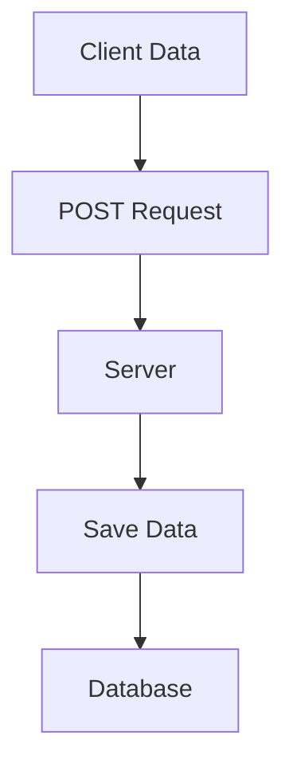

---

## **12. UPDATE API (PUT/PATCH Operation)**

### **Definition**

UPDATE API modifies existing records.

Uses PUT or PATCH method.

---

### **Example**

```javascript
app.put('/students/:id',async(req,res)=>{
 await Student.updateOne(
  {_id:req.params.id},
  {$set:req.body}
 );
 res.send("Updated");
});
```

---

### **Update Flow (Mermaid)**

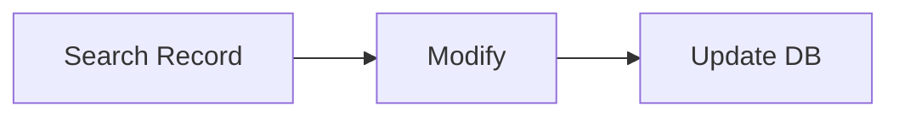

---

## **13. DELETE API (DELETE Operation)**

### **Definition**

DELETE API removes records from database.

Uses DELETE method.

---

### **Example**

```javascript
app.delete('/students/:id',async(req,res)=>{
 await Student.deleteOne({_id:req.params.id});
 res.send("Deleted");
});
```

---

### **Delete Flow (Mermaid)**

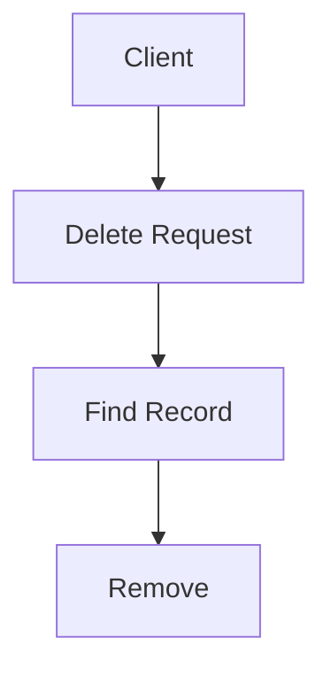

---

## **14. Error Handling in REST APIs**

### **Definition**

Error handling manages unexpected situations in applications.

---

### **Types of Errors**

1. Client errors (400 series)
2. Server errors (500 series)
3. Validation errors
4. Database errors

---

### **Error Handling Middleware**

```javascript
app.use((err,req,res,next)=>{
 res.status(500).send(err.message);
});
```

---

### **Error Flow (Mermaid)**

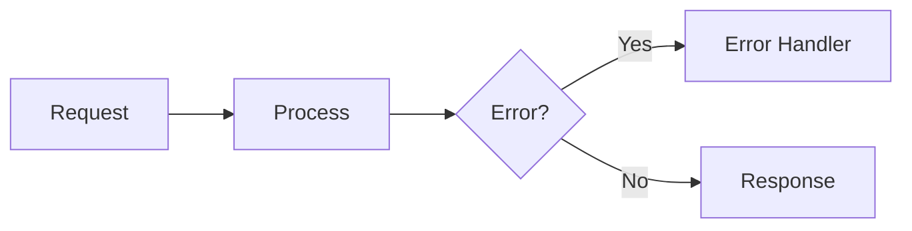

---

## **15. Integrating MongoDB with REST APIs**

### **Definition**

Integration means connecting REST APIs with MongoDB to store and retrieve data.

---

### **Architecture (Mermaid)**

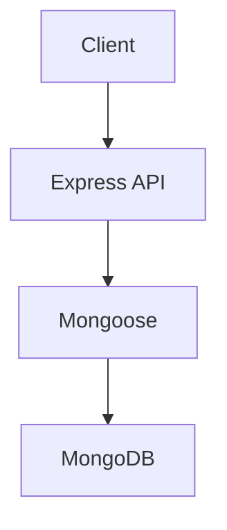

---

### **Example Integration**

```javascript
const mongoose = require('mongoose');

mongoose.connect("mongodb://localhost/db");
```

---

## **16. Using LIST and CREATE APIs Together**

### **Example**

```javascript
app.get('/users',async(req,res)=>{
 res.json(await User.find());
});

app.post('/users',async(req,res)=>{
 await new User(req.body).save();
 res.send("Added");
});
```

---

### **Benefits**

1. Data management
2. Automation
3. Real-time updates
4. Centralized storage

---

## **17. Security in REST APIs**

### **Security Measures**

1. Authentication
2. Authorization
3. Input validation
4. HTTPS
5. JWT tokens

---

### **Example**

```javascript
app.use(jwtAuth);
```

---

## **18. Testing REST APIs**

### **Tools Used**

1. Postman
2. Thunder Client
3. Insomnia

---

### **Purpose**

1. Check response
2. Verify errors
3. Validate data
4. Debug APIs

---

## **19. Advantages of RESTful APIs with Express**

1. Easy development
2. Platform independent
3. Fast response
4. Scalable
5. Secure
6. Maintainable

---

## **20. Practical Applications of Unit–IV Concepts**

1. Student management system
2. Banking APIs
3. E-commerce backend
4. Hospital systems
5. Online booking systems
6. Inventory management

---

Below is a **complete exam-oriented 20-mark answer for UNIT–V** of **Full Stack Application Development**, prepared strictly according to your instructions, with **diagrams in Mermaid syntax**.

---

# **UNIT – V: WORKING WITH REACT ROUTER AND FORMS**

---

## **1. Introduction to React Router**

### **Definition**

React Router is a standard library used in React applications to implement **client-side routing**.

It allows navigation between different pages without reloading the browser.

---

### **Need for React Router**

1. Enables Single Page Application (SPA)
2. Improves performance
3. Provides smooth navigation
4. Avoids full page reload
5. Manages multiple views

---

### **Traditional vs SPA Routing**

| Feature     | Traditional | React Router |
| ----------- | ----------- | ------------ |
| Reload      | Yes         | No           |
| Speed       | Slow        | Fast         |
| UX          | Poor        | Better       |
| Server load | High        | Low          |

---

### **SPA Routing Architecture (Mermaid)**

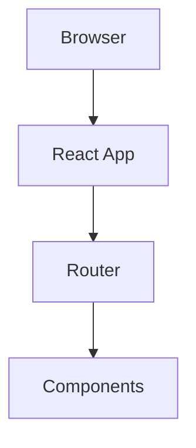

---

## **2. Installation and Setup of React Router**

### **Installation**

```
npm install react-router-dom
```

---

### **Basic Setup**

```javascript
import {BrowserRouter,Routes,Route} from 'react-router-dom';

function App(){
 return(
  <BrowserRouter>
   <Routes>
    <Route path="/" element={<Home/>}/>
   </Routes>
  </BrowserRouter>
 );
}
```

---

### **Components of React Router**

1. BrowserRouter
2. Routes
3. Route
4. Link
5. NavLink
6. Navigate

---

## **3. Simple Routing**

### **Definition**

Simple routing means mapping one URL path to one component.

---

### **Example**

```javascript
<Route path="/about" element={<About/>}/>
```

---

### **Simple Routing Flow (Mermaid)**

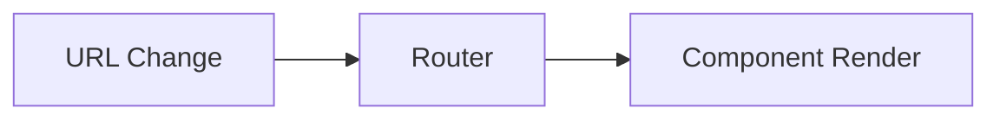

---

## **4. Route Parameters**

### **Definition**

Route parameters are dynamic values passed through URL.

They are used to identify specific records.

---

### **Syntax**

```
/user/:id
```

---

### **Example**

```javascript
<Route path="/user/:id" element={<User/>}/>
```

```javascript
import {useParams} from 'react-router-dom';

const {id} = useParams();
```

---

### **Parameter Flow (Mermaid)**

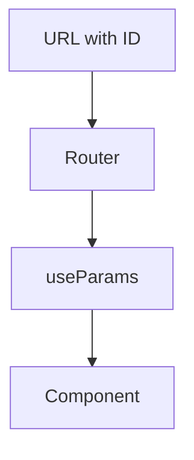

---

## **5. Route Query Strings**

### **Definition**

Query strings are key-value pairs appended to URL.

---

### **Example URL**

```
/search?name=ram&age=20
```

---

### **Accessing Query Strings**

```javascript
import {useSearchParams} from 'react-router-dom';

const [params] = useSearchParams();
const name = params.get("name");
```

---

### **Query String Flow (Mermaid)**

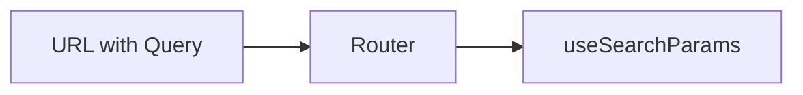

---

## **6. Programmatic Routing**

### **Definition**

Programmatic routing means navigating automatically using code.

---

### **Hook Used**

useNavigate()

---

### **Example**

```javascript
import {useNavigate} from 'react-router-dom';

const nav = useNavigate();
nav('/home');
```

---

### **Navigation Flow (Mermaid)**

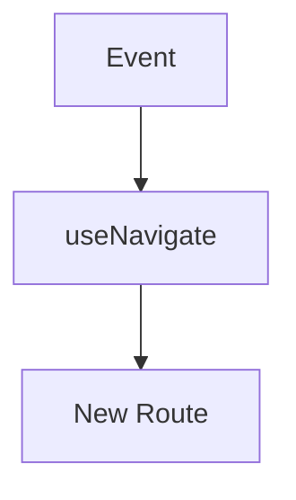

---

## **7. Nested Routes**

### **Definition**

Nested routing means displaying child routes inside parent routes.

---

### **Example**

```javascript
<Route path="/dashboard" element={<Dashboard/>}>
 <Route path="profile" element={<Profile/>}/>
</Route>
```

---

### **Nested Routing Structure (Mermaid)**

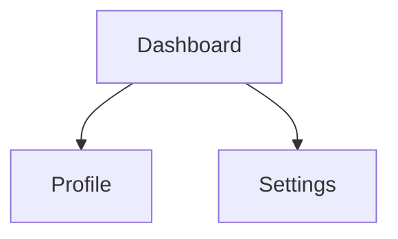

---

## **8. Browser History Management**

### **Definition**

Browser history stores navigation records.

React Router manages it automatically.

---

### **Functions**

1. Back
2. Forward
3. Replace

---

### **Example**

```javascript
nav(-1);
nav(1);
nav('/login',{replace:true});
```

---

### **History Flow (Mermaid)**

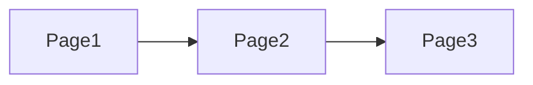

---

## **9. Introduction to React Forms**

### **Definition**

Forms are used to collect user input.

They include text fields, buttons, checkboxes, etc.

---

### **Types of Forms**

1. Controlled Forms
2. Uncontrolled Forms

---

## **10. Controlled Components**

### **Definition**

In controlled components, form data is controlled by React state.

---

### **Example**

```javascript
const [name,setName]=useState("");

<input value={name} onChange={e=>setName(e.target.value)}/>
```

---

### **Controlled Form Flow (Mermaid)**

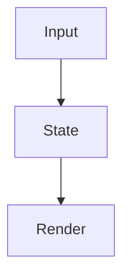

---

## **11. Uncontrolled Components**

### **Definition**

Uncontrolled components store data in DOM.

React uses refs to access data.

---

### **Example**

```javascript
const inputRef = useRef();

<input ref={inputRef}/>
```

---

### **Uncontrolled Flow (Mermaid)**

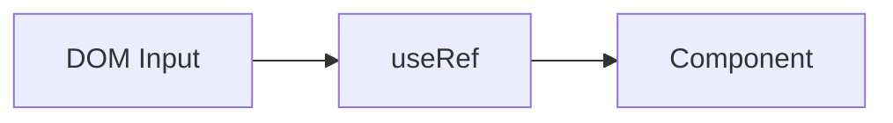

---

## **12. Form Validation**

### **Definition**

Form validation ensures correct and complete input.

---

### **Types of Validation**

1. Client-side
2. Server-side

---

### **Example**

```javascript
if(name===""){
 alert("Enter name");
}
```

---

### **Validation Flow (Mermaid)**

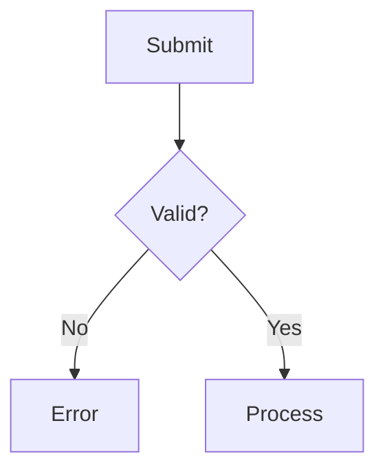

---

## **13. Filtering Data Using Forms**

### **Definition**

Filtering means displaying selected data based on input.

---

### **Example**

```javascript
data.filter(item=>item.name.includes(search));
```

---

### **Filter Flow (Mermaid)**

```mermaid
flowchart LR
    A[Input] --> B[Filter Logic]
    B --> C[Display]
```

---

## **14. Get API Integration**

### **Definition**

GET API is used to fetch data from backend.

---

### **Example**

```javascript
useEffect(()=>{
 fetch('/api/users')
 .then(res=>res.json())
 .then(data=>setUsers(data));
},[]);
```

---

### **API Flow (Mermaid)**

```mermaid
graph TD
    A[React App] --> B[GET API]
    B --> C[Server]
    C --> D[Database]
```

---

## **15. Edit Page Implementation**

### **Definition**

Edit page allows updating existing records.

---

### **Process**

1. Fetch data
2. Display in form
3. Modify
4. Update API

---

### **Example**

```javascript
useEffect(()=>{
 fetch(`/api/user/${id}`)
},[]);
```

---

### **Edit Flow (Mermaid)**

```mermaid
flowchart TD
    A[List Page] --> B[Edit Page]
    B --> C[Form]
    C --> D[Update API]
```

---

## **16. UI Components in React**

### **Definition**

UI components are reusable design elements.

---

### **Examples**

1. Button
2. Modal
3. Card
4. Navbar
5. Footer

---

### **Example**

```javascript
function Button(props){
 return <button>{props.text}</button>;
}
```

---

## **17. Update API Integration**

### **Definition**

Update API modifies data in database.

Uses PUT/PATCH.

---

### **Example**

```javascript
fetch(`/api/user/${id}`,{
 method:'PUT',
 body:JSON.stringify(data)
});
```

---

### **Update Flow (Mermaid)**

```mermaid
flowchart LR
    A[Edit Form] --> B[PUT API]
    B --> C[Server]
```

---

## **18. Delete API Integration**

### **Definition**

Delete API removes records.

Uses DELETE.

---

### **Example**

```javascript
fetch(`/api/user/${id}`,{
 method:'DELETE'
});
```

---

### **Delete Flow (Mermaid)**

```mermaid
flowchart TD
    A[Button Click] --> B[DELETE API]
    B --> C[Database]
```

---

## **19. Advantages of React Router and Forms**

1. Fast navigation
2. Better UX
3. Easy form handling
4. Data validation
5. Reusable components
6. Secure input handling

---

## **20. Practical Applications of Unit–V Concepts**

1. Login systems
2. Registration forms
3. Admin dashboards
4. E-commerce pages
5. Student portals
6. Booking systems

---


