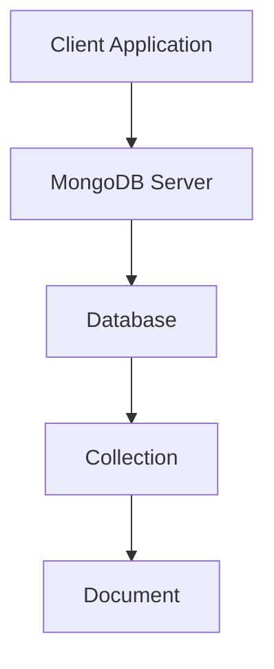
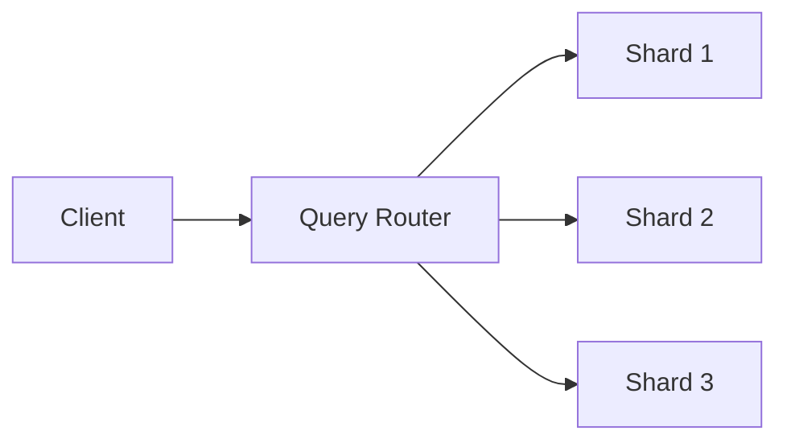
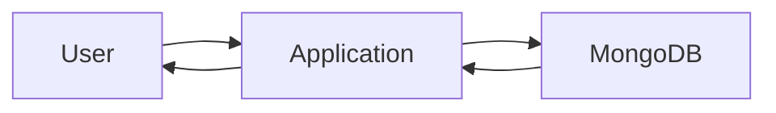
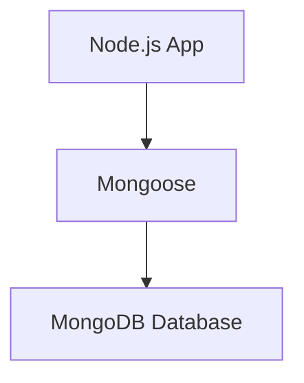
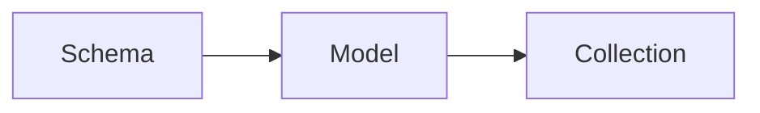
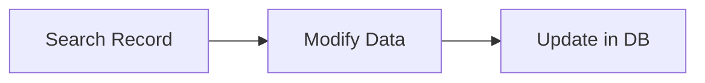

# FSAD-SEE
Below is a **complete exam-oriented 20-mark answer for UNIT–I** of **Full Stack Application Development**, prepared strictly according to your instructions.

---

# **UNIT – I: INTRODUCTION TO FULL STACK DEVELOPMENT AND MERN STACK**

---

## **1. Introduction to Full Stack Development**

### **Definition**

Full Stack Development refers to the process of designing, developing, and maintaining **both the front-end and back-end parts** of a web application along with database and deployment.

A Full Stack Developer works on:

* User Interface (UI)
* Server-side logic
* Database management
* Deployment and maintenance

---

### **Components of Full Stack Development**

A full stack application consists of **three main layers**:

#### 1. Front-End (Client Side)

* Runs in the user’s browser
* Responsible for UI and interaction
* Technologies used:

  * HTML
  * CSS
  * JavaScript
  * React.js

#### 2. Back-End (Server Side)

* Handles business logic
* Processes requests
* Connects to database
* Technologies used:

  * Node.js
  * Express.js
  * Java
  * Python

#### 3. Database Layer

* Stores application data
* Manages records
* Technologies used:

  * MongoDB
  * MySQL
  * PostgreSQL

---

### **Architecture of Full Stack Application**

```
User (Browser)
      ↓
Front-End (React)
      ↓
Back-End (Node + Express)
      ↓
Database (MongoDB)
```

---

### **Technologies Associated with Full Stack**

| Layer           | Technology                   |
| --------------- | ---------------------------- |
| Front-End       | HTML, CSS, JavaScript, React |
| Back-End        | Node.js, Express             |
| Database        | MongoDB                      |
| Version Control | Git                          |
| Hosting         | AWS, Netlify                 |

---

### **Advantages of Full Stack Development**

1. Complete control over application
2. Faster development
3. Cost-effective
4. Easy maintenance
5. Better understanding of system

---

### **Applications**

* E-commerce websites
* Social media platforms
* Banking systems
* Learning management systems
* Online portals

---

## **2. Introduction to MERN Stack**

### **Definition**

MERN Stack is a popular JavaScript-based technology stack used for building full stack web applications.

MERN stands for:

| Letter | Technology |
| ------ | ---------- |
| M      | MongoDB    |
| E      | Express.js |
| R      | React.js   |
| N      | Node.js    |

---

### **Architecture of MERN Stack**

```
Browser (React)
      ↓
Express Server
      ↓
Node.js Runtime
      ↓
MongoDB Database
```

---

### **Components of MERN Stack**

#### 1. MongoDB

* NoSQL database
* Stores data in JSON-like format
* Uses collections and documents

#### 2. Express.js

* Web framework for Node.js
* Handles routing and middleware

#### 3. React.js

* Front-end library
* Used to build UI components

#### 4. Node.js

* JavaScript runtime
* Runs JavaScript on server

---

### **Advantages of MERN Stack**

1. Uses single language (JavaScript)
2. Fast development
3. Open source
4. Scalable
5. High performance

---

## **3. MVC Architectural Pattern**

### **Definition**

MVC stands for **Model–View–Controller**.
It is a design pattern used to separate application logic.

---

### **Components of MVC**

#### 1. Model

* Handles data
* Communicates with database
* Contains business logic

#### 2. View

* Displays UI
* Shows data to user

#### 3. Controller

* Controls application flow
* Connects Model and View

---

### **MVC Architecture Diagram**

```
User
 ↓
View  ←→ Controller ←→ Model ←→ Database
```

---

### **Advantages of MVC**

1. Separation of concerns
2. Easy maintenance
3. Reusable code
4. Better testing

---

### **Application in MERN**

* Model → MongoDB + Mongoose
* View → React
* Controller → Express Routes

---

## **4. Introduction to Node.js**

### **Definition**

Node.js is an open-source, server-side JavaScript runtime environment used to build scalable network applications.

---

### **Features of Node.js**

1. Event-driven
2. Non-blocking I/O
3. Single-threaded
4. High performance
5. Asynchronous execution

---

### **Event-Driven Programming**

Node.js works on events.

Example:

* User request = Event
* Server response = Event handler

```
Request → Event → Handler → Response
```

---

### **JavaScript Closures in Node.js**

#### Definition

A closure is a function that remembers its outer variables.

#### Example

```javascript
function outer() {
  let count = 0;
  return function inner() {
    count++;
    return count;
  }
}
```

Closures help in:

* Data privacy
* Memory management

---

### **Node.js Modules**

#### Definition

Modules are reusable blocks of code.

---

#### Types of Modules

##### 1. Core Modules

Built-in modules

Examples:

* fs
* http
* path
* os

##### 2. Local Modules

User-defined modules

##### 3. Third-Party Modules

Installed using npm

Example:

* express
* mongoose

---

### **CommonJS Modules**

Uses `require()` and `module.exports`

Example:

```javascript
const math = require('./math');
module.exports = add;
```

---

### **Node.js File Modules**

Used to handle files

Example:

```javascript
const fs = require('fs');
fs.readFile('data.txt');
```

Functions:

* readFile()
* writeFile()
* appendFile()
* delete()

---

## **5. Developing Node.js Web Application**

### **Steps**

1. Install Node.js
2. Create project folder
3. Initialize npm
4. Install packages
5. Create server
6. Run application

---

### **npm Initialization**

```
npm init
```

Creates `package.json`

---

### **Basic Server Example**

```javascript
const http = require('http');

http.createServer((req,res)=>{
 res.write("Hello World");
 res.end();
}).listen(3000);
```

---

## **6. Middleware in Node.js**

### **Definition**

Middleware is a function that executes between request and response.

---

### **Flow of Middleware**

```
Request → Middleware → Route → Response
```

---

### **Types of Middleware**

1. Application-level
2. Router-level
3. Error-handling
4. Built-in
5. Third-party

---

### **Example**

```javascript
app.use((req,res,next)=>{
 console.log("Middleware");
 next();
});
```

---

## **7. Introduction to Express.js**

### **Definition**

Express.js is a lightweight web framework for Node.js used to create APIs and web applications.

---

### **Features**

1. Routing
2. Middleware support
3. Fast server
4. REST API creation
5. Template engines

---

### **Installing Express**

```
npm install express
```

---

### **Creating Express App**

```javascript
const express = require('express');
const app = express();
```

---

## **8. Express Application Structure**

### **Main Components**

1. Application Object
2. Request Object
3. Response Object
4. Router
5. Middleware

---

### **Application Object**

```javascript
const app = express();
```

Controls server.

---

### **Request Object (req)**

Contains:

* URL
* Headers
* Body
* Parameters

Example:

```javascript
req.params
req.body
```

---

### **Response Object (res)**

Used to send response

Example:

```javascript
res.send("Hello");
res.json(data);
```

---

## **9. External Middleware**

### **Definition**

External middleware are third-party packages used for extra features.

---

### **Examples**

| Middleware  | Purpose             |
| ----------- | ------------------- |
| body-parser | Parse request body  |
| cors        | Enable cross-origin |
| morgan      | Logging             |
| helmet      | Security            |

---

### **Example**

```javascript
const bodyParser = require('body-parser');
app.use(bodyParser.json());
```

---

## **10. Advantages of Using Express and Node.js**

1. High speed
2. Scalability
3. Lightweight
4. Real-time support
5. Easy API creation
6. Large community
7. Cross-platform

---

## **11. Practical Applications of Unit–I Concepts**

1. REST API development
2. E-commerce backend
3. Authentication systems
4. Chat applications
5. Blog platforms
6. Management systems

---

UNIT-2

Below is a **complete exam-oriented 20-mark answer for UNIT–II** of **Full Stack Application Development**, prepared strictly according to your instructions.

---

# **UNIT – II: UNDERSTANDING REACT AND WEB SERVER & REACT STATE**

---

## **1. Introduction to React and Web Server**

### **Definition**

React is an open-source JavaScript library used for building **interactive and dynamic user interfaces** for web applications.

A Web Server is a system that receives requests from clients (browsers) and sends web pages or data as responses.

In MERN stack:

* React works on the client side
* Node.js + Express works as the web server

---

### **Role of React in Full Stack Development**

React is used to:

1. Create dynamic UI
2. Update pages without reload
3. Improve user experience
4. Manage application components
5. Communicate with backend APIs

---

### **Client–Server Architecture**

```
Browser (React)
      ↓ Request
Web Server (Node + Express)
      ↓
Database (MongoDB)
      ↑
   Response
```

---

## **2. Server Setup for React Application**

### **Definition**

Server setup refers to the configuration of tools and environment required to run React applications and backend services.

---

### **Steps for Server Setup**

#### Step 1: Install Node.js

Node.js must be installed to run React.

Check version:

```
node -v
npm -v
```

---

#### Step 2: Install React App Tool

```
npx create-react-app myapp
```

Creates a React project.

---

#### Step 3: Start Development Server

```
cd myapp
npm start
```

Runs server on:

```
http://localhost:3000
```

---

### **Folder Structure of React App**

```
myapp/
 ├── node_modules
 ├── public
 ├── src
 │   ├── App.js
 │   ├── index.js
 │   └── components
 └── package.json
```

---

## **3. NVM (Node Version Manager)**

### **Definition**

NVM is a tool used to install and manage multiple versions of Node.js on a single system.

---

### **Features of NVM**

1. Switch between versions
2. Install old/new versions
3. Manage projects easily
4. Avoid compatibility issues

---

### **Commands**

Install Node version:

```
nvm install 16
```

Use version:

```
nvm use 16
```

List versions:

```
nvm list
```

---

## **4. Node.js, NPM, and Express in React Environment**

---

### **Node.js**

* Runs JavaScript on server
* Manages backend
* Supports API creation

---

### **NPM (Node Package Manager)**

#### Definition

NPM is used to install and manage libraries in Node.js projects.

---

#### Functions of NPM

1. Install packages
2. Update packages
3. Remove packages
4. Maintain dependencies

---

#### Example

```
npm install axios
```

---

### **Express.js**

Used to create backend APIs.

Example:

```javascript
const express = require('express');
const app = express();

app.get('/',(req,res)=>{
  res.send("Hello");
});
```

---

## **5. Build-Time JSX Compilation**

### **Definition**

JSX is a syntax extension that allows writing HTML inside JavaScript.

Before execution, JSX is converted into JavaScript.

This process is called **JSX Compilation**.

---

### **JSX Example**

```javascript
const element = <h1>Hello</h1>;
```

Converted to:

```javascript
React.createElement("h1",null,"Hello");
```

---

### **Compilation Process**

```
JSX → Babel → JavaScript → Browser
```

---

### **Role of Babel**

Babel is a compiler that converts modern JavaScript and JSX into browser-compatible code.

---

## **6. Separate Script File, Transform, and Automate**

---

### **Separate Script File**

React uses separate JavaScript files for components.

Example:

```
Header.js
Footer.js
```

---

### **Transform**

Transform means converting modern code into old compatible code.

Done using:

* Babel
* Webpack

---

### **Automate**

Automation means automatically compiling, bundling, and refreshing code.

Tools used:

* Webpack
* Create React App
* Vite

---

### **Benefits**

1. Faster development
2. Less manual work
3. Error detection
4. Automatic reload

---

## **7. React Library**

### **Definition**

React library provides functions and tools for building UI components.

---

### **Main Features**

1. Virtual DOM
2. Component-based
3. Reusable code
4. Fast rendering
5. One-way data binding

---

### **Virtual DOM**

Virtual DOM is a lightweight copy of real DOM.

```
Change → Virtual DOM → Compare → Update Real DOM
```

Improves performance.

---

## **8. React Components**

### **Definition**

Components are independent and reusable blocks of UI.

---

### **Types of Components**

#### 1. Class Components

```javascript
class Welcome extends React.Component {
 render() {
  return <h1>Hello</h1>;
 }
}
```

---

#### 2. Functional Components

```javascript
function Welcome() {
 return <h1>Hello</h1>;
}
```

---

### **Advantages of Components**

1. Reusability
2. Easy maintenance
3. Modular structure
4. Readable code

---

## **9. Composing Components**

### **Definition**

Composing means combining multiple components into one.

---

### **Example**

```javascript
function App() {
 return (
  <Header/>
  <Content/>
  <Footer/>
 );
}
```

---

### **Benefits**

1. Better structure
2. Easy management
3. Clean design

---

## **10. Passing Data Using Properties (Props)**

### **Definition**

Props are used to pass data from parent to child components.

---

### **Example**

```javascript
function Student(props) {
 return <h1>{props.name}</h1>;
}

<Student name="Rahul"/>
```

---

### **Characteristics of Props**

1. Read-only
2. Immutable
3. One-way data flow
4. Used for communication

---

## **11. Property Validation**

### **Definition**

Property validation ensures correct type of data is passed.

---

### **Using PropTypes**

```javascript
Student.propTypes = {
 name: PropTypes.string
};
```

---

### **Benefits**

1. Avoid errors
2. Improve reliability
3. Debugging support

---

## **12. Using Children in React**

### **Definition**

Children allow passing components inside components.

---

### **Example**

```javascript
function Box(props) {
 return <div>{props.children}</div>;
}
```

---

### **Usage**

Used in:

* Layouts
* Containers
* Wrappers

---

## **13. Dynamic Composition**

### **Definition**

Dynamic composition means creating components at runtime based on data.

---

### **Example**

```javascript
items.map(item => <List data={item}/>)
```

---

### **Advantages**

1. Flexible UI
2. Dynamic rendering
3. Data-driven design

---

## **14. Understanding React State**

### **Definition**

State is an object that stores dynamic data of a component.

---

### **Example**

```javascript
const [count,setCount] = useState(0);
```

---

### **Characteristics of State**

1. Mutable
2. Local to component
3. Triggers re-render
4. Manages data

---

## **15. Setting State**

### **Using useState Hook**

```javascript
const [name,setName] = useState("Ram");
```

---

### **Updating State**

```javascript
setName("Shyam");
```

---

### **Rules**

1. Do not modify directly
2. Use setter function
3. Updates are asynchronous

---

## **16. Event Handling in React**

### **Definition**

Event handling allows responding to user actions.

---

### **Example**

```javascript
<button onClick={handleClick}>Click</button>
```

---

### **Common Events**

| Event    | Purpose      |
| -------- | ------------ |
| onClick  | Mouse click  |
| onChange | Input change |
| onSubmit | Form submit  |

---

## **17. Communication from Child to Parent**

### **Definition**

Child-to-parent communication is done using callback functions.

---

### **Example**

```javascript
function Parent() {
 function getData(data){
  console.log(data);
 }

 return <Child send={getData}/>;
}
```

---

## **18. Stateless Components**

### **Definition**

Stateless components do not maintain state.

They depend only on props.

---

### **Example**

```javascript
function Hello(props){
 return <h1>{props.name}</h1>;
}
```

---

### **Advantages**

1. Simple
2. Fast
3. Easy testing
4. Less memory

---

## **19. Designing Components: State vs Props**

| Feature    | State        | Props         |
| ---------- | ------------ | ------------- |
| Modifiable | Yes          | No            |
| Scope      | Local        | Global        |
| Purpose    | Dynamic data | Communication |
| Control    | Component    | Parent        |

---

## **20. Component Hierarchy Communication**

### **Definition**

Component hierarchy refers to parent-child relationships.

---

### **Types**

1. Parent → Child (Props)
2. Child → Parent (Callback)
3. Sibling (Common parent)

---

### **Diagram**

```
App
 ↓
Parent
 ↓
Child
```

---

## **21. Applications of Unit–II Concepts**

1. Form handling
2. Dashboard UI
3. Admin panels
4. User profiles
5. Dynamic pages
6. SPA applications

---
Below is a **complete exam-oriented 20-mark answer for UNIT–III** of **Full Stack Application Development**, prepared strictly according to your instructions, with **diagrams in Mermaid syntax**.

---

# **UNIT – III: INTRODUCTION TO MONGODB AND MONGOOSE**

---

## **1. Introduction to NoSQL Databases**

### **Definition**

NoSQL (Not Only SQL) databases are non-relational databases designed to store, manage, and retrieve large volumes of unstructured and semi-structured data.

They do not use traditional tables, rows, and columns.

---

### **Features of NoSQL Databases**

1. Schema-less structure
2. High scalability
3. Distributed architecture
4. High performance
5. Flexible data storage

---

### **Types of NoSQL Databases**

| Type           | Example   | Description                |
| -------------- | --------- | -------------------------- |
| Document-based | MongoDB   | Stores JSON-like documents |
| Key-Value      | Redis     | Stores key-value pairs     |
| Column-based   | Cassandra | Stores column families     |
| Graph-based    | Neo4j     | Stores graph data          |

---

### **Applications of NoSQL**

1. Social media platforms
2. Big data systems
3. Real-time analytics
4. IoT applications
5. Content management systems

---

## **2. Introduction to MongoDB**

### **Definition**

MongoDB is an open-source, document-oriented NoSQL database that stores data in JSON-like format called BSON.

---

### **Features of MongoDB**

1. Document-based storage
2. High scalability
3. Indexing support
4. Replication
5. Automatic sharding
6. High availability

---

### **MongoDB Data Structure**

```
Database → Collection → Document → Fields
```

---

### **MongoDB Architecture (Mermaid Diagram)**



---

### **Components of MongoDB**

1. Database – Container for collections
2. Collection – Group of documents
3. Document – Record in JSON format
4. Field – Key-value pair

---

### **Example MongoDB Document**

```json
{
  "id": 101,
  "name": "Rahul",
  "course": "MCA",
  "marks": 85
}
```

---

## **3. MongoDB Sharding**

### **Definition**

Sharding is a method of distributing data across multiple servers to improve performance and scalability.

Each server stores a part of the data.

---

### **Need for Sharding**

1. Handle large data
2. Improve performance
3. Reduce server load
4. Support horizontal scaling

---

### **Sharding Architecture (Mermaid Diagram)**



---

### **Components of Sharding**

1. Shard – Stores part of data
2. Config Server – Stores metadata
3. Query Router (mongos) – Routes queries

---

### **Advantages of Sharding**

1. High availability
2. Better load balancing
3. Supports big data
4. Faster queries

---

## **4. MongoDB CRUD Operations**

### **Definition**

CRUD stands for:

* Create
* Read
* Update
* Delete

These are basic database operations.

---

## **4.1 Create Operations**

### **Using insertOne()**

```javascript
db.students.insertOne({
 name:"Amit",
 marks:80
});
```

---

### **Using insertMany()**

```javascript
db.students.insertMany([
 {name:"Ravi",marks:75},
 {name:"Sita",marks:85}
]);
```

---

### **Using save()**

```javascript
db.students.save({
 name:"John",
 marks:90
});
```

---

## **4.2 Read Operations**

### **Using find()**

```javascript
db.students.find();
```

Returns all documents.

---

### **Using findOne()**

```javascript
db.students.findOne({name:"Amit"});
```

Returns single document.

---

### **Using Filters**

```javascript
db.students.find({marks:{$gt:80}});
```

---

## **4.3 Update Operations**

### **Using updateOne()**

```javascript
db.students.updateOne(
 {name:"Amit"},
 {$set:{marks:90}}
);
```

---

### **Using updateMany()**

```javascript
db.students.updateMany(
 {course:"MCA"},
 {$set:{grade:"A"}}
);
```

---

## **4.4 Delete Operations**

### **Using deleteOne()**

```javascript
db.students.deleteOne({name:"Amit"});
```

---

### **Using deleteMany()**

```javascript
db.students.deleteMany({course:"MCA"});
```

---

## **CRUD Operation Flow (Mermaid Diagram)**



---

## **5. Introduction to Mongoose**

### **Definition**

Mongoose is an Object Data Modeling (ODM) library for MongoDB and Node.js.

It provides schema-based modeling.

---

### **Features of Mongoose**

1. Schema validation
2. Relationship support
3. Middleware
4. Easy queries
5. Data casting

---

### **Role of Mongoose in MERN**

```
Node.js → Mongoose → MongoDB
```

---

## **6. Connecting MongoDB Using Mongoose**

### **Example**

```javascript
const mongoose = require('mongoose');

mongoose.connect('mongodb://localhost:27017/studentDB')
.then(()=>console.log("Connected"))
.catch(err=>console.log(err));
```

---

### **Connection Architecture (Mermaid Diagram)**



---

## **7. Understanding Mongoose Schema**

### **Definition**

Schema defines the structure of documents in a collection.

It specifies fields and their data types.

---

### **Example Schema**

```javascript
const studentSchema = new mongoose.Schema({
 name: String,
 age: Number,
 course: String,
 marks: Number
});
```

---

### **Advantages of Schema**

1. Data consistency
2. Validation
3. Better structure
4. Error reduction

---

## **8. Creating Mongoose Model**

### **Definition**

A Model is a compiled version of schema used to perform database operations.

---

### **Example**

```javascript
const Student = mongoose.model("Student",studentSchema);
```

---

### **Schema–Model Relationship (Mermaid Diagram)**



---

## **9. Registering User Model**

### **Definition**

Registering a model means creating a structure to store user data.

---

### **Example**

```javascript
const userSchema = new mongoose.Schema({
 username:String,
 email:String,
 password:String
});

const User = mongoose.model("User",userSchema);
```

---

## **10. Creating Documents Using save()**

### **Definition**

save() is used to store data in database.

---

### **Example**

```javascript
const user = new User({
 username:"ram",
 email:"ram@gmail.com",
 password:"1234"
});

user.save();
```

---

### **Process Flow (Mermaid Diagram)**

flowchart TD
    A[Create Object] --> B[Call save()]
    B --> C[Validate Schema]
    C --> D[Store in MongoDB]


---

## **11. Finding Documents Using find()**

### **Example**

```javascript
User.find({},(err,data)=>{
 console.log(data);
});
```

---

### **Finding Multiple Records**

Returns array of documents.

---

## **12. Reading Single Document Using findOne()**

### **Example**

```javascript
User.findOne({username:"ram"});
```

Returns first matched record.

---

### **Advantages**

1. Fast access
2. Less memory
3. Simple query

---

## **13. Updating Existing Documents**

### **Example**

```javascript
User.updateOne(
 {username:"ram"},
 {$set:{email:"new@gmail.com"}}
);
```

---

### **Update Flow (Mermaid Diagram)**



---

## **14. Deleting Existing Documents**

### **Example**

```javascript
User.deleteOne({username:"ram"});
```

---

### **Delete Process**

1. Search document
2. Verify condition
3. Remove data

---

## **15. Extending Mongoose Schema**

### **Definition**

Schema extension means adding extra rules and features.

---

## **15.1 Default Values**

### **Example**

```javascript
const schema = new mongoose.Schema({
 status:{type:String,default:"Active"}
});
```

---

## **15.2 Schema Modifiers**

| Modifier | Purpose         |
| -------- | --------------- |
| required | Mandatory field |
| unique   | Unique value    |
| trim     | Remove spaces   |
| min/max  | Range control   |

---

### **Example**

```javascript
name:{type:String,required:true}
```

---

## **15.3 Predefined Modifiers**

### **Example**

```javascript
age:{type:Number,min:18,max:60}
```

---

## **15.4 Custom Setter Modifiers**

### **Definition**

Setter modifies value before saving.

---

### **Example**

```javascript
name:{
 type:String,
 set:value => value.toUpperCase()
}
```

---

## **15.5 Custom Getter Modifiers**

### **Definition**

Getter modifies value when retrieving.

---

### **Example**

```javascript
marks:{
 type:Number,
 get:v => Math.round(v)
}
```

---

## **16. Advantages of Using MongoDB with Mongoose**

1. Structured data modeling
2. Easy CRUD operations
3. Validation support
4. Security
5. Performance
6. Scalable design

---

## **17. Practical Applications of Unit–III Concepts**

1. User management systems
2. Student databases
3. E-commerce product storage
4. Banking applications
5. Hospital management systems
6. Inventory systems

---


