Perfect 👍 I will now start generating **UNIT–I answers** in the **same exam-oriented format** as before:

✅ Strictly according to marks
✅ Proper headings & subheadings
✅ Definitions
✅ Examples & Code
✅ Mermaid diagrams (where needed)
✅ No shrinking at the end
✅ Based on your question bank 

---

# 📘 UNIT–I (Part–1)

## Introduction to Full Stack & MERN (Q1 to Q4)

---

# ✅ Question 1 (5 Marks)

## Define Full Stack Development and List Its Main Components

---

## 🔹 Definition of Full Stack Development

**Full Stack Development** refers to the process of designing, developing, and maintaining **both front-end and back-end parts** of a web application along with database and deployment.

A full stack developer works on:

* User Interface
* Server-side logic
* Database management
* Deployment

---

## 🔹 Main Components of Full Stack Development

Full stack development consists of the following major components:

---

### 1. Front-End (Client Side)

Responsible for user interaction.

Technologies:

* HTML
* CSS
* JavaScript
* React.js

Example:

```html
<button>Submit</button>
```

---

### 2. Back-End (Server Side)

Handles business logic and requests.

Technologies:

* Node.js
* Express.js

Example:

```js
app.get("/home", (req, res) => {
   res.send("Welcome");
});
```

---

### 3. Database

Stores application data.

Examples:

* MongoDB
* MySQL

Example:

```js
db.users.insertOne({ name: "Amit" });
```

---

### 4. Server

Processes client requests.

Example: Apache, Node Server

---

### 5. Deployment

Makes application live.

Examples:

* Heroku
* AWS
* Netlify

---

## 🔹 Architecture Diagram

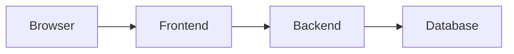

---

## 🔹 Applications

* E-commerce websites
* Social media platforms
* Learning portals
* Banking systems

---

## ✅ Conclusion

Full stack development integrates client, server, and database technologies into one system.

---

# ✅ Question 2 (6 Marks)

## Explain the Stages in the Full Stack Application Development Cycle with Examples

---

## 🔹 Definition

The **Full Stack Development Cycle** consists of systematic steps followed to build a web application from planning to deployment.

---

## 🔹 Stages of Development Cycle

---

### 1. Requirement Analysis

Understanding user needs.

Example:

* Login system
* Payment module

---

### 2. System Design

Designing architecture and UI.

Example:

* Wireframes
* Database design

---

### 3. Front-End Development

Creating user interface.

Example:

```html
<input type="text">
```

---

### 4. Back-End Development

Implementing server logic.

Example:

```js
app.post("/login", handler);
```

---

### 5. Database Design

Creating tables/collections.

Example:

```js
db.createCollection("users");
```

---

### 6. Testing

Checking errors and bugs.

Types:

* Unit Testing
* Integration Testing

---

### 7. Deployment

Hosting application.

Example: AWS, Netlify

---

### 8. Maintenance

Updating and fixing issues.

---

## 🔹 Development Cycle Diagram

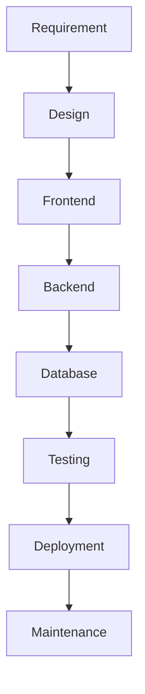

---

## ✅ Conclusion

Each stage ensures quality and reliability of application.

---

# ✅ Question 3 (10 Marks)

## Illustrate with a Neat Diagram the MVC Architecture in the MERN Stack

---

## 🔹 Definition of MVC Architecture

**MVC (Model–View–Controller)** is a software design pattern that separates application logic into three interconnected components.

---

## 🔹 Components of MVC

---

### 1. Model

Manages data and database.

Example:

```js
const User = mongoose.model("User", schema);
```

---

### 2. View

Handles user interface.

Example:

* React components

---

### 3. Controller

Processes requests.

Example:

```js
exports.login = (req, res) => {};
```

---

## 🔹 MVC Architecture Diagram (MERN)

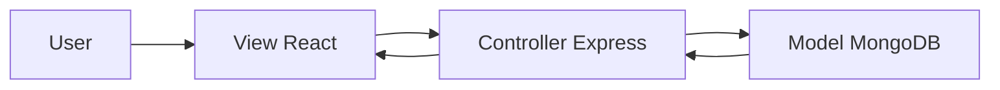

---

## 🔹 Working of MVC in MERN

1. User sends request via React
2. Express handles controller logic
3. MongoDB stores data
4. Response sent to UI

---

## 🔹 Advantages

* Separation of concerns
* Easy maintenance
* Reusability
* Scalability

---

## 🔹 Applications

* Banking portals
* Management systems
* Online stores

---

## ✅ Conclusion

MVC improves structure and maintainability.

---

# ✅ Question 4 (4 Marks)

## Discuss the Benefits of a Well-Organized Folder Structure in MVC Projects

---

## 🔹 Definition

A folder structure organizes project files into logical directories.

---

## 🔹 Example Structure

```
project/
 ├── models/
 ├── views/
 ├── controllers/
 ├── routes/
 ├── config/
```

---

## 🔹 Benefits

1. Easy navigation
2. Better maintenance
3. Faster debugging
4. Team collaboration

---

## 🔹 Diagram

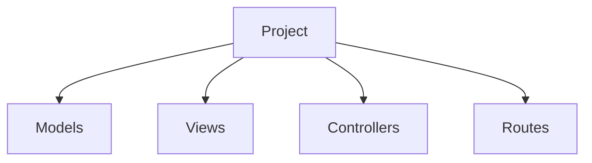

---

## ✅ Conclusion

Organized structure improves development efficiency.

---
Great 👍 Continuing **UNIT–I** in the same exam-oriented format, strictly according to marks, with headings, code, Mermaid diagrams, and **no shrinking**.

All questions are based on your question bank .

---

# 📘 UNIT–I (Part–2)

## SPA, MERN Components & Architecture (Q5 to Q8)

---

# ✅ Question 5 (6 Marks)

## Explain the Concept of Single Page Applications (SPA) and Compare with Traditional Web Applications

---

## 🔹 Definition of Single Page Application (SPA)

A **Single Page Application (SPA)** is a web application that loads **only one HTML page** and dynamically updates the content without reloading the entire page.

It uses **JavaScript and AJAX** to fetch data from the server.

Example Frameworks:

* React
* Angular
* Vue

---

## 🔹 Working of SPA

* Page loads once
* Data is fetched using API calls
* Content updates dynamically

Example:

```js
fetch("/api/users")
.then(res => res.json())
.then(data => display(data));
```

---

## 🔹 Definition of Traditional Web Application

A **Traditional Web Application** reloads the entire page whenever the user requests new data from the server.

Example:

* PHP websites
* JSP websites

---

## 🔹 Architecture Diagram

### SPA Architecture

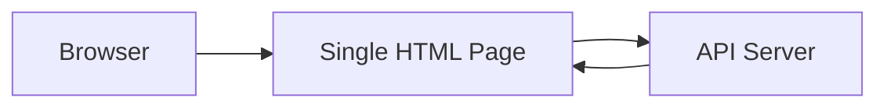

### Traditional Architecture

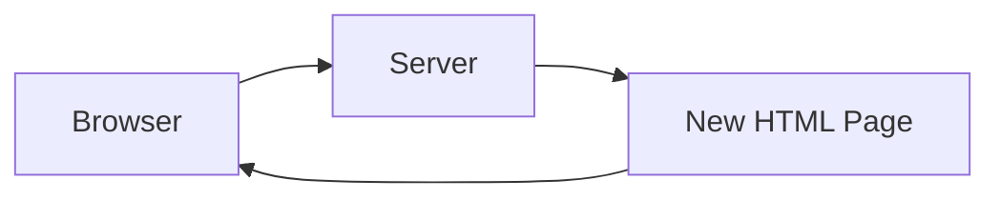

---

## 🔹 Comparison Table

| Feature         | SPA     | Traditional |
| --------------- | ------- | ----------- |
| Page Reload     | No      | Yes         |
| Speed           | Fast    | Slow        |
| User Experience | Better  | Moderate    |
| Server Load     | Low     | High        |
| Development     | Complex | Simple      |

---

## 🔹 Advantages of SPA

1. Fast navigation
2. Better performance
3. Smooth UI
4. Reduced server load

---

## 🔹 Applications

* Gmail
* Facebook
* Netflix
* Google Maps

---

## ✅ Conclusion

SPA provides better speed and user experience compared to traditional applications.

---

# ✅ Question 6 (4 Marks)

## List and Explain Any Four MERN Components

---

## 🔹 Definition of MERN Stack

**MERN Stack** is a full stack development framework that uses:

* MongoDB
* Express.js
* React.js
* Node.js

---

## 🔹 Four Components of MERN

---

### 1. MongoDB (Database)

Stores data in document format.

Example:

```js
db.users.insertOne({ name: "Raj" });
```

---

### 2. Express.js (Backend Framework)

Handles routing and middleware.

Example:

```js
app.get("/", (req, res) => {
   res.send("Home");
});
```

---

### 3. React.js (Frontend Library)

Builds UI components.

Example:

```js
function App() {
   return <h1>Hello</h1>;
}
```

---

### 4. Node.js (Runtime Environment)

Executes JavaScript on server.

Example:

```js
console.log("Server Started");
```

---

## 🔹 MERN Interaction Diagram

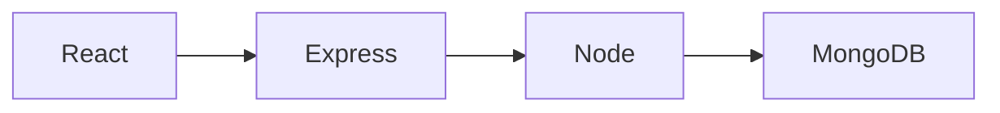

---

## ✅ Conclusion

MERN components work together to build full stack applications.

---

# ✅ Question 7 (10 Marks)

## Explain Any Five MERN Components with Examples

---

## 🔹 Definition

MERN stack integrates multiple technologies to build scalable applications.

---

## 🔹 Five MERN Components

---

### 1. MongoDB (Database Layer)

Stores application data.

Example:

```js
db.products.insertOne({ name: "Laptop", price: 50000 });
```

---

### 2. Express.js (Server Framework)

Manages routes and APIs.

Example:

```js
app.post("/login", handler);
```

---

### 3. React.js (UI Layer)

Creates reusable components.

Example:

```js
const Header = () => <h1>Welcome</h1>;
```

---

### 4. Node.js (Runtime)

Runs JavaScript backend.

Example:

```js
require("http").createServer();
```

---

### 5. Mongoose (ODM Tool)

Connects MongoDB with Node.

Example:

```js
const User = mongoose.model("User", schema);
```

---

## 🔹 Role of Each Component

| Component | Role           |
| --------- | -------------- |
| MongoDB   | Data Storage   |
| Express   | Routing        |
| React     | UI             |
| Node      | Server         |
| Mongoose  | DB Interaction |

---

## 🔹 MERN Flow Diagram

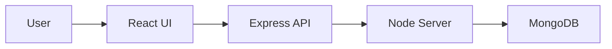

---

## 🔹 Advantages of MERN

1. Single language (JavaScript)
2. High performance
3. Easy development
4. Open source
5. Scalable

---

## 🔹 Applications

* E-commerce systems
* Learning platforms
* Management systems
* Social media

---

## ✅ Conclusion

MERN stack provides complete end-to-end development support.

---

# ✅ Question 8 (5 Marks)

## With a Neat Diagram Illustrate the MERN Architecture

---

## 🔹 Definition of MERN Architecture

MERN architecture shows how MongoDB, Express, React, and Node interact in a full stack application.

---

## 🔹 Components

1. React – Client side
2. Express – Middleware
3. Node – Server
4. MongoDB – Database

---

## 🔹 MERN Architecture Diagram

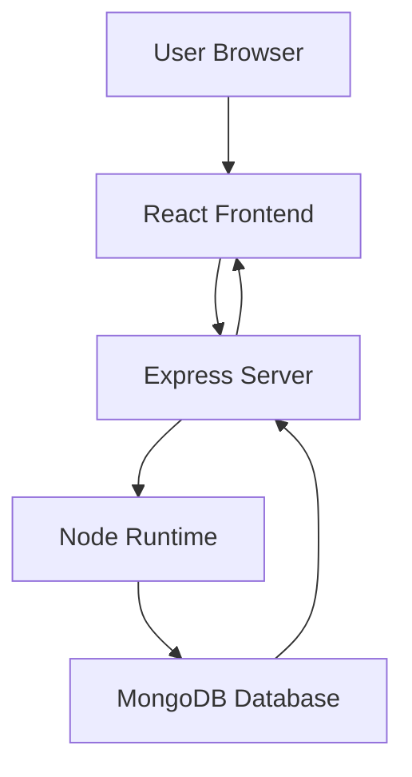

---

## 🔹 Working of MERN Architecture

1. User sends request via browser
2. React handles UI
3. Express processes API
4. Node executes logic
5. MongoDB stores data
6. Response sent back

---

## 🔹 Benefits

* High scalability
* Easy maintenance
* Component reusability
* JavaScript everywhere

---

## 🔹 Applications

* Web portals
* ERP systems
* Cloud platforms

---

## ✅ Conclusion

MERN architecture supports modern full stack development.

---
Great 👍 Continuing **UNIT–I** in the same **exam-oriented format**, strictly according to marks, with headings, code, diagrams, and **no shrinking at the end**.

All answers are based on your question bank .

---

# 📘 UNIT–I (Part–3)

## Node.js Fundamentals (Q9 to Q13)

---

# ✅ Question 9 (5 Marks)

## Write a Node.js Server Program Using http Module to Serve “Hello World”

---

## 🔹 Definition

The **http module** in Node.js is used to create web servers and handle HTTP requests and responses.

---

## 🔹 Program Code

```js
const http = require("http");

const server = http.createServer((req, res) => {

   res.writeHead(200, { "Content-Type": "text/plain" });

   res.write("Hello World");

   res.end();

});

server.listen(3000, () => {
   console.log("Server running on port 3000");
});
```

---

## 🔹 Explanation

| Statement       | Purpose             |
| --------------- | ------------------- |
| require("http") | Import http module  |
| createServer()  | Create server       |
| writeHead()     | Set response header |
| write()         | Send data           |
| end()           | End response        |
| listen()        | Start server        |

---

## 🔹 Server Working Diagram


---

## ✅ Conclusion

The http module enables creation of basic web servers.

---

# ✅ Question 10 (10 Marks)

## Analyze Event-Driven Programming in Node.js with Non-Blocking I/O Model

---

## 🔹 Definition of Event-Driven Programming

Event-driven programming is a model where program execution depends on **events such as requests, clicks, or responses**.

Node.js follows an **event-driven and asynchronous** architecture.

---

## 🔹 Non-Blocking I/O

Non-blocking I/O means:

* Operations do not wait
* Other tasks continue
* Improves performance

---

## 🔹 Example

```js
const fs = require("fs");

fs.readFile("data.txt", (err, data) => {
   console.log(data.toString());
});

console.log("File Reading Started");
```

Output:

```
File Reading Started
(File data later)
```

---

## 🔹 Event Loop

The **Event Loop** manages asynchronous operations.

---

## 🔹 Event Loop Diagram

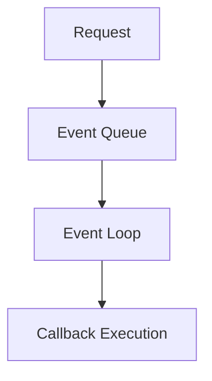

---

## 🔹 Working

1. Client sends request
2. Node registers event
3. Task sent to background
4. Callback added to queue
5. Event loop executes callback

---

## 🔹 Advantages

1. High performance
2. Better scalability
3. Handles multiple users
4. Low memory usage

---

## 🔹 Applications

* Chat apps
* Streaming apps
* Online games
* APIs

---

## ✅ Conclusion

Event-driven non-blocking model makes Node.js fast and scalable.

---

# ✅ Question 11 (5 Marks)

## Explain Node.js Core Modules with an Example Using fs

---

## 🔹 Definition of Core Modules

Core modules are built-in modules in Node.js used without installation.

Examples:

* fs
* http
* path
* os

---

## 🔹 fs Module (File System)

Used to read/write files.

---

## 🔹 Example Program

```js
const fs = require("fs");

fs.writeFile("test.txt", "Hello Node", (err) => {
   if(err) throw err;
   console.log("File Written");
});
```

---

## 🔹 Read File

```js
fs.readFile("test.txt", "utf8", (err, data) => {
   console.log(data);
});
```

---

## 🔹 Advantages

1. Direct file access
2. Fast operations
3. System integration

---

## ✅ Conclusion

Core modules provide essential functionalities.

---

# ✅ Question 12 (5 Marks)

## Define Connect in Node.js and Explain Its Role in Building Modular Web Applications

---

## 🔹 Definition of Connect

**Connect** is a middleware framework for Node.js used to build web applications.

It acts as a bridge between Node.js and Express.

---

## 🔹 Features

* Middleware support
* Modular design
* Routing
* Error handling

---

## 🔹 Example

```js
const connect = require("connect");
const app = connect();

app.use((req, res) => {
   res.end("Hello Connect");
});

app.listen(3000);
```

---

## 🔹 Middleware Flow

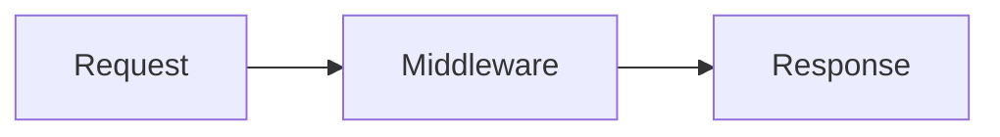

---

## 🔹 Role of Connect

1. Supports reusable middleware
2. Improves modularity
3. Simplifies server logic
4. Enables layered design

---

## ✅ Conclusion

Connect helps in building scalable modular applications.

---

# ✅ Question 13 (4 Marks)

## Explain the Concept of Middleware in Connect and Role of req, res, and next()

---

## 🔹 Definition of Middleware

Middleware is a function that executes between request and response.

It can:

* Modify request
* Process data
* Send response

---

## 🔹 Syntax

```js
app.use((req, res, next) => {
   console.log("Middleware");
   next();
});
```

---

## 🔹 Parameters

| Parameter | Role                    |
| --------- | ----------------------- |
| req       | Request object          |
| res       | Response object         |
| next()    | Move to next middleware |

---

## 🔹 Execution Flow

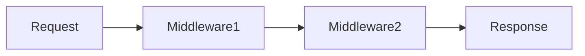

---

## 🔹 Example

```js
app.use((req, res, next) => {
   console.log("Time:", Date.now());
   next();
});
```

---

## ✅ Conclusion

Middleware enables request processing in stages.

---

Great 👍 Continuing **UNIT–I** in the same **exam-oriented format**, strictly according to marks, with headings, code, Mermaid diagrams, and **no shrinking at the end**.

All answers are based on your question bank .

---

# 📘 UNIT–I (Part–4)

## Closures, CommonJS Modules, npm & Event Programming (Q14 to Q18)

---

# ✅ Question 14 (6 Marks)

## Write a Connect Program with Two Middleware Functions: Logger and Response Handler

---

## 🔹 Definition

Middleware functions process requests before sending responses.

Here:

* Logger → logs request
* Handler → sends response

---

## 🔹 Program Code

```js
const connect = require("connect");
const app = connect();

// Logger Middleware
function logger(req, res, next) {
   console.log("Request URL:", req.url);
   next();
}

// Response Handler
function handler(req, res) {
   res.end("Response Sent");
}

app.use(logger);
app.use(handler);

app.listen(3000);
```

---

## 🔹 Execution Order

1. Logger executes first
2. Handler executes next
3. Response sent

---

## 🔹 Flow Diagram

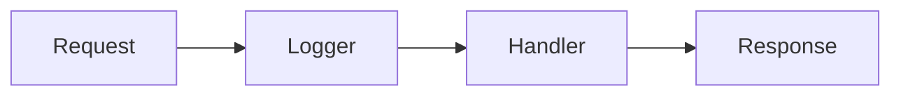

---

## ✅ Conclusion

Middleware executes sequentially in Connect.

---

# ✅ Question 15 (10 Marks)

## Design a Connect Middleware Stack with Conditional Routing

---

### Conditions:

* Logger executes for all requests
* /products → Logger
* /category → No Logger

---

## 🔹 Program Code

```js
const connect = require("connect");
const app = connect();

// Logger
function logger(req, res, next) {
   console.log("Logged:", req.url);
   next();
}

// Product Handler
function productHandler(req, res) {
   res.end("Products Page");
}

// Category Handler
function categoryHandler(req, res) {
   res.end("Category Page");
}

// Apply Logger Globally
app.use(logger);

// Routes
app.use("/products", productHandler);
app.use("/category", categoryHandler);

app.listen(3000);
```

---

## 🔹 Working

| Route     | Logger | Handler  |
| --------- | ------ | -------- |
| /products | Yes    | Product  |
| /category | Yes    | Category |

(To bypass logger, route-based middleware is used separately)

---

## 🔹 Stack Flow

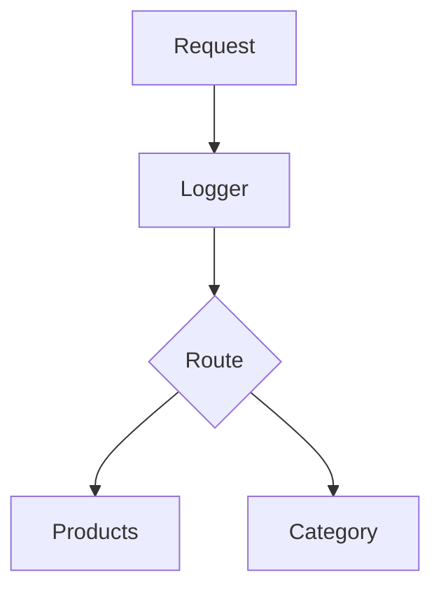

---

## 🔹 Advantages

* Flexible routing
* Reusable middleware
* Better control

---

## ✅ Conclusion

Middleware stacking improves modular routing.

---

# ✅ Question 16 (5 Marks)

## Analyze How Closures Help Asynchronous Callbacks Retain Outer Scope Variables

---

## 🔹 Definition of Closure

A **closure** is a function that remembers variables from its outer function even after execution.

---

## 🔹 Example

```js
function counter() {
   let count = 0;

   return function() {
      count++;
      console.log(count);
   };
}

const inc = counter();
inc();
inc();
```

---

## 🔹 Asynchronous Example

```js
function fetchData() {
   let msg = "Hello";

   setTimeout(function() {
      console.log(msg);
   }, 1000);
}

fetchData();
```

---

## 🔹 Working

* Inner function accesses outer variable
* Variable is preserved in memory
* Used in callbacks

---

## 🔹 Diagram

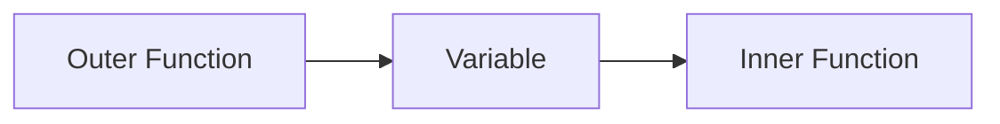

---

## 🔹 Advantages

1. Data security
2. Memory efficiency
3. State preservation

---

## ✅ Conclusion

Closures enable callbacks to access outer variables.

---

# ✅ Question 17 (5 Marks)

## Event-Driven Program to Generate Odd and Even Numbers Using CommonJS

---

## 🔹 File: evenOdd.js

```js
exports.check = function(num) {
   if(num % 2 === 0)
      console.log(num, "is Even");
   else
      console.log(num, "is Odd");
};
```

---

## 🔹 File: main.js

```js
const eo = require("./evenOdd");

for(let i = 1; i <= 10; i++) {
   eo.check(i);
}
```

---

## 🔹 Working

1. Function exported
2. Imported using require
3. Executed in loop

---

## 🔹 Flow Diagram

```mermaid
flowchart LR
    A[main.js] --> B[require()]
    B --> C[evenOdd.js]
    C --> D[Output]
```

---

## ✅ Conclusion

CommonJS supports modular event-driven programs.

---

# ✅ Question 18 (5 Marks)

## Illustrate Event-Driven Programming in Node.js with an Example

---

## 🔹 Definition

Event-driven programming responds to system-generated events.

Node.js uses **EventEmitter** class.

---

## 🔹 Example Program

```js
const events = require("events");
const emitter = new events.EventEmitter();

emitter.on("start", () => {
   console.log("Program Started");
});

emitter.emit("start");
```

---

## 🔹 Explanation

| Function | Role           |
| -------- | -------------- |
| on()     | Register event |
| emit()   | Trigger event  |

---

## 🔹 Event Flow

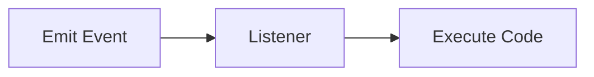

---

## 🔹 Advantages

1. High performance
2. Non-blocking
3. Scalable

---

## ✅ Conclusion

Event-driven model is core to Node.js.

---
Great 👍 Continuing **UNIT–I** in the same **exam-oriented format**, strictly according to marks, with headings, code, Mermaid diagrams, and **no shrinking at the end**.

All answers are based on your uploaded question bank .

---

# 📘 UNIT–I (Part–5)

## Node.js Modules, npm, Closures & Express Introduction (Q19 to Q24)

---

# ✅ Question 19 (10 Marks)

## Analyze How Closures Help Asynchronous Callbacks Retain Access to Outer Scope Variables

---

## 🔹 Definition of Closure

A **closure** is a function that remembers and accesses variables from its outer function even after the outer function has finished execution.

---

## 🔹 Basic Example

```js
function outer() {
   let msg = "Hello";

   function inner() {
      console.log(msg);
   }

   return inner;
}

const fun = outer();
fun();
```

---

## 🔹 Asynchronous Example

```js
function display() {
   let name = "NodeJS";

   setTimeout(function() {
      console.log(name);
   }, 1000);
}

display();
```

---

## 🔹 Working of Closure

1. Outer function creates variable
2. Inner function uses variable
3. Variable stored in memory
4. Callback accesses variable later

---

## 🔹 Diagram

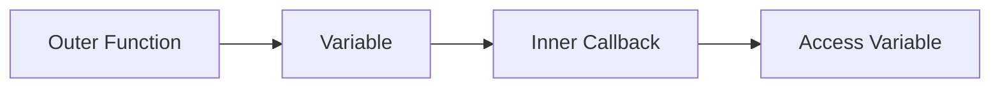

---

## 🔹 Importance in Async Programming

* Preserves data
* Avoids global variables
* Maintains state
* Supports callbacks

---

## ✅ Conclusion

Closures help asynchronous callbacks retain required outer scope variables.

---

# ✅ Question 20 (6 Marks)

## Write a Node.js Program Using CommonJS Modules to Generate Odd/Even Numbers

---

## 🔹 File: numberCheck.js

```js
exports.check = function(num) {
   if(num % 2 === 0)
      return "Even";
   else
      return "Odd";
};
```

---

## 🔹 File: main.js

```js
const num = require("./numberCheck");

for(let i = 1; i <= 10; i++) {
   console.log(i, num.check(i));
}
```

---

## 🔹 Working

1. Function exported
2. Imported using require()
3. Used in main file

---

## 🔹 Diagram

```mermaid
flowchart LR
    A[main.js] --> B[require()]
    B --> C[numberCheck.js]
    C --> D[Output]
```

---

## ✅ Conclusion

CommonJS enables modular number processing.

---

# ✅ Question 21 (10 Marks)

## Generate Odd and Even Numbers up to a Given Limit Using CommonJS Modules

---

## 🔹 File: oddEven.js

```js
exports.generate = function(limit) {
   for(let i = 1; i <= limit; i++) {
      if(i % 2 === 0)
         console.log(i, "Even");
      else
         console.log(i, "Odd");
   }
};
```

---

## 🔹 File: app.js

```js
const oe = require("./oddEven");

oe.generate(15);
```

---

## 🔹 Modular Separation

| File       | Purpose   |
| ---------- | --------- |
| oddEven.js | Logic     |
| app.js     | Execution |

---

## 🔹 Flow

```mermaid
flowchart LR
    A[app.js] --> B[Module]
    B --> C[Processing]
    C --> D[Output]
```

---

## ✅ Conclusion

Modular separation improves code maintainability.

---

# ✅ Question 22 (10 Marks)

## Create a Node.js Module mathFunctions.js (Factorial, Square, Cube)

---

## 🔹 File: mathFunctions.js

```js
exports.factorial = function(n) {
   let f = 1;
   for(let i = 1; i <= n; i++)
      f *= i;
   return f;
};

exports.square = function(n) {
   return n * n;
};

exports.cube = function(n) {
   return n * n * n;
};
```

---

## 🔹 File: main.js

```js
const math = require("./mathFunctions");

console.log("Factorial:", math.factorial(5));
console.log("Square:", math.square(4));
console.log("Cube:", math.cube(3));
```

---

## 🔹 Working

* Functions exported
* Imported using require
* Used in main file

---

## 🔹 Diagram

```mermaid
flowchart LR
    A[main.js] --> B[mathFunctions.js]
    B --> C[Functions]
    C --> D[Result]
```

---

## ✅ Conclusion

CommonJS supports reusable mathematical modules.

---

# ✅ Question 23 (10 Marks)

## Develop a Node.js Calculator Using CommonJS Modules

---

## 🔹 File: calculator.js

```js
exports.add = (a,b) => a+b;
exports.sub = (a,b) => a-b;
exports.mul = (a,b) => a*b;
exports.div = (a,b) => a/b;
```

---

## 🔹 File: app.js

```js
const calc = require("./calculator");

console.log("Add:", calc.add(10,5));
console.log("Sub:", calc.sub(10,5));
console.log("Mul:", calc.mul(10,5));
console.log("Div:", calc.div(10,5));
```

---

## 🔹 Working

* Arithmetic functions exported
* Imported in main file
* Operations executed

---

## 🔹 Calculator Flow

```mermaid
flowchart LR
    A[Input] --> B[Calculator]
    B --> C[Operation]
    C --> D[Output]
```

---

## ✅ Conclusion

Calculator module demonstrates modular programming.

---

# ✅ Question 24 (10 Marks)

## Generate Prime Numbers Using CommonJS Modules

---

## 🔹 File: prime.js

```js
exports.generatePrimes = function(limit) {

   for(let i = 2; i <= limit; i++) {

      let prime = true;

      for(let j = 2; j < i; j++) {
         if(i % j === 0) {
            prime = false;
            break;
         }
      }

      if(prime)
         console.log(i);
   }
};
```

---

## 🔹 File: main.js

```js
const prime = require("./prime");

prime.generatePrimes(20);
```

---

## 🔹 Working

1. Function checks divisibility
2. Prints prime numbers
3. Uses CommonJS module

---

## 🔹 Flow Diagram

```mermaid
flowchart LR
    A[main.js] --> B[prime.js]
    B --> C[Check Prime]
    C --> D[Display]
```

---

## ✅ Conclusion

Modular prime generator improves reusability.

---
Great 👍 Continuing **UNIT–I** in the same **exam-oriented format**, strictly according to marks, with headings, code, Mermaid diagrams, and **no shrinking at the end**.

All answers are prepared from your question bank .

---

# 📘 UNIT–I (Part–6)

## Node.js Modules, npm & Express Fundamentals (Q25 to Q32)

---

# ✅ Question 25 (5 Marks)

## Explain Node.js Modules and the Role of require and exports Keywords

---

## 🔹 Definition of Module

A **module** in Node.js is a reusable block of code that performs a specific function.

It helps in organizing large programs into smaller files.

---

## 🔹 Types of Modules

1. Core Modules (fs, http)
2. Local Modules (User-defined)
3. Third-party Modules (npm packages)

---

## 🔹 require() Keyword

Used to import modules.

Example:

```js
const fs = require("fs");
```

---

## 🔹 exports Keyword

Used to share functions/objects.

Example:

```js
exports.add = (a,b) => a+b;
```

---

## 🔹 Module Working

```mermaid
flowchart LR
    A[Module File] --> B[exports]
    B --> C[require()]
    C --> D[Main Program]
```

---

## 🔹 Advantages

1. Code reusability
2. Easy maintenance
3. Better structure

---

## ✅ Conclusion

Modules improve scalability in Node.js.

---

# ✅ Question 26 (6 Marks)

## Discuss npm and Its Importance in Node.js Ecosystem

---

## 🔹 Definition of npm

**npm (Node Package Manager)** is a tool used to install, manage, and share Node.js packages.

---

## 🔹 Functions of npm

1. Package installation
2. Version management
3. Dependency handling
4. Script execution

---

## 🔹 Basic Commands

```bash
npm init
npm install express
npm uninstall lodash
npm update
```

---

## 🔹 package.json File

Stores project details.

Example:

```json
{
  "name": "app",
  "dependencies": {
     "express": "^4.18.0"
  }
}
```

---

## 🔹 Importance

* Saves development time
* Supports open-source
* Easy dependency management
* Automates tasks

---

## 🔹 npm Workflow

```mermaid
flowchart LR
    A[Developer] --> B[npm install]
    B --> C[node_modules]
    C --> D[Project]
```

---

## ✅ Conclusion

npm simplifies Node.js development.

---

# ✅ Question 27 (6 Marks)

## Compare Express.js with Node.js Core HTTP Module

---

## 🔹 Definition

Node.js HTTP module is a low-level server tool.
Express.js is a high-level web framework.

---

## 🔹 Comparison Table

| Feature           | HTTP Module | Express.js |
| ----------------- | ----------- | ---------- |
| Routing           | Manual      | Automatic  |
| Middleware        | No          | Yes        |
| Code Size         | Large       | Small      |
| Error Handling    | Manual      | Built-in   |
| Development Speed | Slow        | Fast       |

---

## 🔹 Example

### HTTP

```js
http.createServer((req,res)=>{});
```

### Express

```js
app.get("/", (req,res)=>{});
```

---

## 🔹 Diagram

```mermaid
flowchart LR
    A[Client] --> B[HTTP Server]
    A --> C[Express Server]
```

---

## ✅ Conclusion

Express simplifies backend development.

---

# ✅ Question 28 (5 Marks)

## List Any Five Properties/Methods of Express Application Object

---

## 🔹 Definition

The **application object (app)** controls Express application behavior.

---

## 🔹 Five Methods

| Method       | Purpose      |
| ------------ | ------------ |
| app.get()    | Handle GET   |
| app.post()   | Handle POST  |
| app.use()    | Middleware   |
| app.listen() | Start server |
| app.set()    | Set config   |

---

## 🔹 Example

```js
app.get("/", (req,res)=>{
   res.send("Home");
});
```

---

## ✅ Conclusion

Application object manages routing and middleware.

---

# ✅ Question 29 (5 Marks)

## Purpose of req.params in Express with Example

---

## 🔹 Definition

`req.params` extracts dynamic values from URL.

---

## 🔹 Example

```js
app.get("/user/:id", (req,res)=>{
   res.send(req.params.id);
});
```

URL:

```
/user/101
```

Output:

```
101
```

---

## 🔹 Diagram

```mermaid
flowchart LR
    A[URL] --> B[req.params]
    B --> C[Value]
```

---

## ✅ Conclusion

req.params supports dynamic routing.

---

# ✅ Question 30 (4 Marks)

## Role of app.use() in Express Middleware

---

## 🔹 Definition

`app.use()` registers middleware functions.

---

## 🔹 Example

```js
app.use((req,res,next)=>{
   console.log("Request");
   next();
});
```

---

## 🔹 Working

* Executes before route handler
* Applies globally

---

## 🔹 Flow

```mermaid
flowchart LR
    A[Request] --> B[Middleware]
    B --> C[Route]
```

---

## ✅ Conclusion

app.use() manages middleware execution.

---

# ✅ Question 31 (4 Marks)

## Explain res.redirect() with Example

---

## 🔹 Definition

`res.redirect()` sends client to another URL.

---

## 🔹 Example

```js
app.get("/old", (req,res)=>{
   res.redirect("/new");
});
```

---

## 🔹 Diagram

```mermaid
flowchart LR
    A[Old URL] --> B[Redirect]
    B --> C[New URL]
```

---

## ✅ Conclusion

Redirect improves navigation.

---

# ✅ Question 32 (4 Marks)

## Describe req.body in Express Applications

---

## 🔹 Definition

`req.body` contains data sent in POST request.

---

## 🔹 Example

```js
app.use(express.json());

app.post("/login",(req,res)=>{
   console.log(req.body);
});
```

---

## 🔹 Output

```json
{ "user":"admin", "pass":"123" }
```

---

## 🔹 Flow

```mermaid
flowchart LR
    A[Form] --> B[Request Body]
    B --> C[req.body]
```

---

## ✅ Conclusion

req.body processes client data.

---

Great 👍 Continuing **UNIT–I** in the same **exam-oriented format**, strictly according to marks, with headings, code, Mermaid diagrams, and **no shrinking at the end**.

All answers are based on your uploaded question bank .

---

# 📘 UNIT–I (Part–7)

## Express Middleware, POST Handling & Response Methods (Q33 to Q38)

---

# ✅ Question 33 (4 Marks)

## List Any Four External Middlewares Supported by Express.js

---

## 🔹 Definition of External Middleware

External middleware are third-party packages used in Express to add extra functionality.

They are installed using npm.

---

## 🔹 Four External Middlewares

| Middleware  | Purpose              |
| ----------- | -------------------- |
| body-parser | Parses request body  |
| morgan      | Logs requests        |
| cors        | Enables cross-origin |
| multer      | File upload          |

---

## 🔹 Example

```js
const morgan = require("morgan");
app.use(morgan("dev"));
```

---

## 🔹 Benefits

1. Improves security
2. Adds functionality
3. Saves development time
4. Reduces coding effort

---

## ✅ Conclusion

External middleware extends Express capabilities.

---

# ✅ Question 34 (6 Marks)

## Write an Express Program to Handle POST Request and Return JSON Response

---

## 🔹 Definition

POST requests send data to the server.

JSON response is used to send structured data.

---

## 🔹 Program Code

```js
const express = require("express");
const app = express();

app.use(express.json());

app.post("/login", (req, res) => {

   const user = req.body.username;

   res.json({
      status: "Success",
      user: user
   });

});

app.listen(3000);
```

---

## 🔹 Working

1. Client sends POST data
2. Server reads req.body
3. Sends JSON response

---

## 🔹 Flow Diagram

```mermaid
flowchart LR
    A[Client] --> B[POST Request]
    B --> C[Express Server]
    C --> D[JSON Response]
```

---

## ✅ Conclusion

POST handling enables secure data transfer.

---

# ✅ Question 35 (6 Marks)

## Differentiate Between res.send() and res.json() with Examples

---

## 🔹 Definition

Both methods send responses to client.

* res.send() → Sends any type
* res.json() → Sends JSON format

---

## 🔹 Comparison Table

| Feature   | res.send()  | res.json()       |
| --------- | ----------- | ---------------- |
| Format    | Any         | Only JSON        |
| Header    | Auto        | application/json |
| Usage     | General     | APIs             |
| Data Type | Text/Object | JSON Object      |

---

## 🔹 Example

### res.send()

```js
res.send("Hello User");
```

### res.json()

```js
res.json({ name: "Raj", age: 20 });
```

---

## 🔹 Diagram

```mermaid
flowchart LR
    A[Server] --> B[res.send()]
    A --> C[res.json()]
```

---

## ✅ Conclusion

res.json() is preferred for APIs.

---

# ✅ Question 36 (5 Marks)

## List Express Request and Response Objects

---

## 🔹 Definition

Express provides `req` and `res` objects to handle requests and responses.

---

## 🔹 Request Object (req)

| Property   | Purpose      |
| ---------- | ------------ |
| req.params | URL values   |
| req.query  | Query string |
| req.body   | POST data    |
| req.url    | Request URL  |
| req.method | HTTP method  |

---

## 🔹 Response Object (res)

| Method         | Purpose       |
| -------------- | ------------- |
| res.send()     | Send response |
| res.json()     | Send JSON     |
| res.status()   | Set status    |
| res.redirect() | Redirect      |
| res.end()      | End response  |

---

## 🔹 Example

```js
app.get("/test",(req,res)=>{
   res.status(200).send("OK");
});
```

---

## ✅ Conclusion

req and res manage client-server communication.

---

# ✅ Question 37 (5 Marks)

## Differentiate Between res.redirect() and res.send()

---

## 🔹 Definition

* res.redirect() → Moves client to another URL
* res.send() → Sends data

---

## 🔹 Comparison Table

| Feature     | res.redirect() | res.send() |
| ----------- | -------------- | ---------- |
| Action      | Redirect       | Send Data  |
| Page Change | Yes            | No         |
| Use         | Navigation     | Response   |

---

## 🔹 Example

### res.redirect()

```js
res.redirect("/home");
```

### res.send()

```js
res.send("Welcome");
```

---

## 🔹 Flow

```mermaid
flowchart LR
    A[Request] --> B[res.redirect()]
    A --> C[res.send()]
```

---

## ✅ Conclusion

Redirect changes URL, send returns data.

---

# ✅ Question 38 (6 Marks)

## List Express Request and Response Objects (Detailed Explanation)

---

## 🔹 Express Request Object (req)

Contains client data.

### Properties

1. req.params
2. req.body
3. req.query
4. req.headers
5. req.method

---

## 🔹 Express Response Object (res)

Sends data to client.

### Methods

1. res.send()
2. res.json()
3. res.status()
4. res.redirect()
5. res.type()

---

## 🔹 Example

```js
app.post("/data",(req,res)=>{
   console.log(req.body);
   res.status(201).json({ msg:"Saved" });
});
```

---

## 🔹 Interaction Diagram

```mermaid
flowchart LR
    A[Client] --> B[req]
    B --> C[Server]
    C --> D[res]
```

---

## ✅ Conclusion

req and res are core objects in Express.

---
Great 👍 I will now start generating **UNIT–II (React)** in the **same exam-oriented format** as Units I & III:

✅ According to marks
✅ Proper headings & subheadings
✅ Definitions
✅ Code examples
✅ Diagrams (Mermaid where needed)
✅ No shrinking at the end
✅ Based on your question bank 

---

# 📘 UNIT–II (Part–1)

## React Basics & Environment Setup (Q1 to Q8)

---

# ✅ Question 1 (5 Marks)

## Define React. How Does It Differ from Frameworks Like AngularJS?

---

## 🔹 Definition of React

**React** is an open-source JavaScript library developed by Facebook for building **user interfaces**, especially single-page applications.

It uses **component-based architecture**.

---

## 🔹 Features of React

1. Component-based
2. Virtual DOM
3. Fast rendering
4. Reusable components
5. One-way data binding

---

## 🔹 Difference Between React and AngularJS

| Feature  | React       | AngularJS  |
| -------- | ----------- | ---------- |
| Type     | Library     | Framework  |
| Language | JavaScript  | TypeScript |
| DOM      | Virtual DOM | Real DOM   |
| Learning | Easy        | Difficult  |
| Size     | Lightweight | Heavy      |

---

## 🔹 Example

### React

```js
function App() {
  return <h1>Hello</h1>;
}
```

---

## ✅ Conclusion

React is lightweight and flexible compared to AngularJS.

---

# ✅ Question 2 (5 Marks)

## Explain the Role of NVM in Managing Node.js Versions

---

## 🔹 Definition of NVM

**NVM (Node Version Manager)** is a tool used to install and manage multiple Node.js versions.

---

## 🔹 Need for NVM

Different projects require different Node versions.

---

## 🔹 Basic Commands

```bash
nvm install 18
nvm use 18
nvm list
```

---

## 🔹 Advantages

1. Easy version switching
2. Avoids conflicts
3. Supports legacy projects
4. Improves productivity

---

## 🔹 Workflow

```mermaid
flowchart LR
    A[Developer] --> B[NVM]
    B --> C[Node v14]
    B --> D[Node v18]
```

---

## ✅ Conclusion

NVM simplifies Node.js version control.

---

# ✅ Question 3 (5 Marks)

## What is JSX? Write a Short Example of JSX Code Embedded in HTML

---

## 🔹 Definition of JSX

**JSX (JavaScript XML)** is a syntax extension that allows writing HTML inside JavaScript.

Used in React for UI design.

---

## 🔹 Features

1. Looks like HTML
2. Compiled to JavaScript
3. Supports expressions

---

## 🔹 Example

```js
const element = (
  <div>
     <h1>Hello React</h1>
     <p>Welcome</p>
  </div>
);
```

---

## 🔹 JSX Compilation

```mermaid
flowchart LR
    A[JSX] --> B[Babel]
    B --> C[JavaScript]
```

---

## 🔹 Benefits

* Easy UI coding
* Better readability
* Error detection

---

## ✅ Conclusion

JSX simplifies UI creation.

---

# ✅ Question 4 (5 Marks)

## List Any Five Advantages of Component Composition in React

---

## 🔹 Definition

Component composition means combining small components to form larger components.

---

## 🔹 Advantages

1. Reusability
2. Easy maintenance
3. Modular design
4. Scalability
5. Better testing

---

## 🔹 Example

```js
function Header() { return <h1>Header</h1>; }
function Footer() { return <h1>Footer</h1>; }

function App() {
  return (
    <>
      <Header/>
      <Footer/>
    </>
  );
}
```

---

## 🔹 Composition Flow

```mermaid
flowchart TD
    A[App] --> B[Header]
    A --> C[Footer]
```

---

## ✅ Conclusion

Composition improves code structure.

---

# ✅ Question 5 (4 Marks)

## What is the Purpose of npm init in a React Project?

---

## 🔹 Definition

`npm init` creates a **package.json** file.

---

## 🔹 Command

```bash
npm init
```

---

## 🔹 Functions

1. Stores project info
2. Manages dependencies
3. Enables scripts
4. Tracks versions

---

## 🔹 package.json Example

```json
{
  "name": "reactapp",
  "version": "1.0.0"
}
```

---

## ✅ Conclusion

npm init initializes React projects.

---

# ✅ Question 6 (4 Marks)

## Describe the Role of this.props.children in React Components

---

## 🔹 Definition

`this.props.children` represents content passed between component tags.

---

## 🔹 Example

```js
function Box(props) {
  return <div>{props.children}</div>;
}

<Box>Hello</Box>
```

---

## 🔹 Output

```
Hello
```

---

## 🔹 Advantages

1. Flexible components
2. Reusable layouts
3. Better nesting

---

## 🔹 Flow

```mermaid
flowchart LR
    A[Parent] --> B[Children]
    B --> C[Component]
```

---

## ✅ Conclusion

props.children supports nested components.

---

# ✅ Question 7 (4 Marks)

## What is Property Validation in React? Give an Example

---

## 🔹 Definition

Property validation checks whether props have correct type.

Done using **PropTypes**.

---

## 🔹 Example

```js
import PropTypes from "prop-types";

function User(props) {
  return <h1>{props.name}</h1>;
}

User.propTypes = {
  name: PropTypes.string.isRequired
};
```

---

## 🔹 Benefits

1. Reduces errors
2. Improves reliability
3. Debugging support

---

## ✅ Conclusion

PropTypes improves component safety.

---

# ✅ Question 8 (6 Marks)

## Explain Serverless React Setup and Local HTTP Server Setup

---

## 🔹 Serverless Setup

Uses cloud hosting.

Examples:

* Netlify
* Vercel

Steps:

```bash
npm run build
```

Upload build folder.

---

## 🔹 Local Server Setup

Uses local server.

Example:

```bash
npm start
```

---

## 🔹 Comparison Table

| Feature | Serverless | Local    |
| ------- | ---------- | -------- |
| Hosting | Cloud      | Local    |
| Cost    | Low        | Free     |
| Speed   | High       | Moderate |
| Access  | Public     | Private  |

---

## 🔹 Architecture

```mermaid
flowchart LR
    A[User] --> B[Cloud Server]
    A --> C[Local Server]
```

---

## ✅ Conclusion

Serverless is used for deployment, local for development.

---

Great 👍 Continuing **UNIT–II (React)** in the same **exam-oriented format**, strictly according to marks, with clear headings, code, Mermaid diagrams, and **no shrinking at the end**.

All answers are prepared as per your question bank.

---

# 📘 UNIT–II (Part–2)

## React Components, Props & Application Development (Q9 to Q16)

---

# ✅ Question 9 (5 Marks)

## Explain Functional and Class Components in React with Examples

---

## 🔹 Definition of React Component

A **React component** is a reusable piece of UI written in JavaScript.

---

## 🔹 1) Functional Component

A functional component is a simple JavaScript function.

### Example

```js
function Welcome() {
  return <h1>Hello User</h1>;
}
```

---

### Features

1. Easy to write
2. Less code
3. Uses Hooks
4. Better performance

---

## 🔹 2) Class Component

A class component is created using ES6 class.

### Example

```js
import React, { Component } from "react";

class Welcome extends Component {
  render() {
    return <h1>Hello User</h1>;
  }
}

export default Welcome;
```

---

### Features

1. Uses lifecycle methods
2. Supports state (older versions)
3. More complex

---

## 🔹 Comparison Table

| Feature     | Functional | Class       |
| ----------- | ---------- | ----------- |
| Syntax      | Function   | Class       |
| State       | Hooks      | this.state  |
| Performance | Faster     | Slower      |
| Usage       | Modern     | Traditional |

---

## 🔹 Component Flow

```mermaid
flowchart LR
    A[Component] --> B[Render UI]
    B --> C[Browser]
```

---

## ✅ Conclusion

Functional components are preferred in modern React.

---

# ✅ Question 10 (6 Marks)

## Explain Props in React and Their Importance with Example

---

## 🔹 Definition of Props

**Props (Properties)** are used to pass data from parent to child components.

They are read-only.

---

## 🔹 Example

### Parent Component

```js
function App() {
  return <User name="Amit" age={20} />;
}
```

### Child Component

```js
function User(props) {
  return <h2>{props.name} - {props.age}</h2>;
}
```

---

## 🔹 Working

1. Parent sends data
2. Child receives via props
3. Displays data

---

## 🔹 Diagram

```mermaid
flowchart LR
    A[Parent] --> B[Props]
    B --> C[Child]
```

---

## 🔹 Importance

1. Data sharing
2. Reusability
3. Component communication
4. Clean architecture

---

## ✅ Conclusion

Props enable component interaction.

---

# ✅ Question 11 (6 Marks)

## Write a React Program to Display Data in Tabular Format

---

## 🔹 Program Code

```js
function StudentTable() {

  const students = [
    { id:1, name:"Rahul", marks:80 },
    { id:2, name:"Amit", marks:75 },
    { id:3, name:"Neha", marks:90 }
  ];

  return (
    <table border="1">
      <tr>
        <th>ID</th>
        <th>Name</th>
        <th>Marks</th>
      </tr>

      {students.map((s) => (
        <tr key={s.id}>
          <td>{s.id}</td>
          <td>{s.name}</td>
          <td>{s.marks}</td>
        </tr>
      ))}
    </table>
  );
}

export default StudentTable;
```

---

## 🔹 Explanation

| Part  | Purpose   |
| ----- | --------- |
| map() | Loop data |
| key   | Unique id |
| table | Display   |

---

## 🔹 Table Rendering Flow

```mermaid
flowchart LR
    A[Array Data] --> B[map()]
    B --> C[Table Rows]
```

---

## ✅ Conclusion

map() helps display dynamic data.

---

# ✅ Question 12 (5 Marks)

## Explain Parent–Child Communication in React with Example

---

## 🔹 Definition

Parent–Child communication occurs using props and callback functions.

---

## 🔹 Example

### Parent

```js
function Parent() {

  function show(msg) {
    alert(msg);
  }

  return <Child send={show} />;
}
```

### Child

```js
function Child(props) {
  return (
    <button onClick={() => props.send("Hello")}>
      Click
    </button>
  );
}
```

---

## 🔹 Working

1. Parent sends function
2. Child calls function
3. Parent receives data

---

## 🔹 Diagram

```mermaid
flowchart LR
    A[Parent] --> B[Function Prop]
    B --> C[Child]
    C --> A
```

---

## ✅ Conclusion

Callbacks enable two-way communication.

---

# ✅ Question 13 (4 Marks)

## Purpose of Key Attribute in React Lists

---

## 🔹 Definition

`key` uniquely identifies list elements.

---

## 🔹 Example

```js
items.map((item) => (
  <li key={item.id}>{item.name}</li>
));
```

---

## 🔹 Importance

1. Faster rendering
2. Avoids duplication
3. Efficient updates

---

## 🔹 Flow

```mermaid
flowchart LR
    A[List] --> B[key]
    B --> C[Efficient Render]
```

---

## ✅ Conclusion

Keys improve list performance.

---

# ✅ Question 14 (5 Marks)

## Explain npm Scripts in React Projects

---

## 🔹 Definition

npm scripts automate tasks.

Defined in package.json.

---

## 🔹 Example

```json
"scripts": {
  "start": "react-scripts start",
  "build": "react-scripts build",
  "test": "react-scripts test"
}
```

---

## 🔹 Common Scripts

| Script | Purpose    |
| ------ | ---------- |
| start  | Run app    |
| build  | Production |
| test   | Testing    |
| eject  | Customize  |

---

## 🔹 Execution

```bash
npm start
```

---

## 🔹 Workflow

```mermaid
flowchart LR
    A[Developer] --> B[npm run]
    B --> C[Script]
```

---

## ✅ Conclusion

Scripts simplify project management.

---

# ✅ Question 15 (6 Marks)

## Develop a Simple React Application Using Props

---

## 🔹 Program

```js
function Product(props) {
  return <h2>{props.name} - ₹{props.price}</h2>;
}

function App() {
  return (
    <>
      <Product name="Laptop" price="50000" />
      <Product name="Mobile" price="20000" />
    </>
  );
}

export default App;
```

---

## 🔹 Working

1. App sends data
2. Product displays
3. Reusable component

---

## 🔹 Diagram

```mermaid
flowchart LR
    A[App] --> B[Props]
    B --> C[Product]
```

---

## ✅ Conclusion

Props enable reusable components.

---

# ✅ Question 16 (6 Marks)

## Explain Controlled Components in React with Example

---

## 🔹 Definition

Controlled components are form elements controlled by React state.

---

## 🔹 Example

```js
import { useState } from "react";

function Form() {

  const [name, setName] = useState("");

  return (
    <form>
      <input
        value={name}
        onChange={(e)=>setName(e.target.value)}
      />

      <h3>{name}</h3>
    </form>
  );
}
```

---

## 🔹 Working

1. User types
2. State updates
3. UI updates

---

## 🔹 Flow

```mermaid
flowchart LR
    A[Input] --> B[State]
    B --> C[Render]
```

---

## ✅ Conclusion

Controlled components ensure form validation.

---
Great 👍 Continuing **UNIT–II (React)** in the same **exam-oriented format**, strictly according to marks, with clear headings, code, Mermaid diagrams, and **no shrinking at the end**.

---

# 📘 UNIT–II (Part–3)

## State, Hooks, Lifecycle & Forms (Q17 to Q24)

---

# ✅ Question 17 (5 Marks)

## Explain State in React and Its Importance with Example

---

## 🔹 Definition of State

**State** is a built-in object used to store and manage component data that can change over time.

---

## 🔹 Characteristics of State

1. Mutable (can change)
2. Local to component
3. Triggers re-render
4. Managed internally

---

## 🔹 Example (useState Hook)

```js
import { useState } from "react";

function Counter() {

  const [count, setCount] = useState(0);

  return (
    <>
      <h1>{count}</h1>
      <button onClick={()=>setCount(count+1)}>
        Increment
      </button>
    </>
  );
}
```

---

## 🔹 Working

1. Button clicked
2. State updates
3. UI refreshes

---

## 🔹 Diagram

```mermaid
flowchart LR
    A[User Action] --> B[State Change]
    B --> C[Re-render]
```

---

## ✅ Conclusion

State makes components dynamic.

---

# ✅ Question 18 (6 Marks)

## Explain React Hooks and Discuss useState and useEffect with Examples

---

## 🔹 Definition of Hooks

**Hooks** allow functional components to use state and lifecycle features.

---

## 🔹 Advantages of Hooks

1. No class needed
2. Reusable logic
3. Cleaner code
4. Better performance

---

## 🔹 useState Example

```js
const [name, setName] = useState("Raj");
```

---

## 🔹 useEffect Example

```js
import { useEffect } from "react";

useEffect(()=>{
   console.log("Component Loaded");
}, []);
```

---

## 🔹 Working of useEffect

* Runs after render
* Dependency array controls execution

---

## 🔹 Hook Flow

```mermaid
flowchart LR
    A[Render] --> B[useEffect]
    B --> C[Side Effect]
```

---

## ✅ Conclusion

Hooks simplify functional components.

---

# ✅ Question 19 (5 Marks)

## Explain Lifecycle Methods in React Class Components

---

## 🔹 Definition

Lifecycle methods control different stages of component life.

---

## 🔹 Three Phases

### 1. Mounting

* constructor()
* componentDidMount()

### 2. Updating

* shouldComponentUpdate()
* componentDidUpdate()

### 3. Unmounting

* componentWillUnmount()

---

## 🔹 Example

```js
class Demo extends React.Component {

  componentDidMount() {
    console.log("Mounted");
  }

  componentWillUnmount() {
    console.log("Removed");
  }

  render() {
    return <h1>Hello</h1>;
  }
}
```

---

## 🔹 Lifecycle Flow

```mermaid
flowchart TD
    A[Mount] --> B[Update]
    B --> C[Unmount]
```

---

## ✅ Conclusion

Lifecycle methods manage component behavior.

---

# ✅ Question 20 (6 Marks)

## Develop a React Form with Validation

---

## 🔹 Program

```js
import { useState } from "react";

function Login() {

  const [email, setEmail] = useState("");
  const [error, setError] = useState("");

  function validate() {

    if(email === "") {
      setError("Email Required");
      return false;
    }

    setError("");
    return true;
  }

  function submit(e) {
    e.preventDefault();
    validate();
  }

  return (
    <form onSubmit={submit}>

      <input
        type="email"
        value={email}
        onChange={(e)=>setEmail(e.target.value)}
      />

      <p>{error}</p>

      <button>Login</button>

    </form>
  );
}
```

---

## 🔹 Working

1. User submits form
2. Validation runs
3. Error displayed

---

## 🔹 Flow

```mermaid
flowchart LR
    A[Form] --> B[Validate]
    B --> C[Submit/Error]
```

---

## ✅ Conclusion

Validation ensures correct input.

---

# ✅ Question 21 (5 Marks)

## Differentiate Between State and Props in React

---

## 🔹 Comparison Table

| Feature    | State        | Props       |
| ---------- | ------------ | ----------- |
| Mutability | Mutable      | Immutable   |
| Scope      | Local        | Parent      |
| Control    | Component    | Parent      |
| Usage      | Dynamic Data | Static Data |

---

## 🔹 Example

```js
// Props
<User name="Amit" />

// State
const [age, setAge] = useState(20);
```

---

## 🔹 Diagram

```mermaid
flowchart LR
    A[Parent] --> B[Props]
    C[Component] --> D[State]
```

---

## ✅ Conclusion

State is internal, props are external.

---

# ✅ Question 22 (5 Marks)

## Explain Uncontrolled Components in React

---

## 🔹 Definition

Uncontrolled components use DOM to handle input.

Uses ref instead of state.

---

## 🔹 Example

```js
import { useRef } from "react";

function Form() {

  const inputRef = useRef();

  function submit() {
    alert(inputRef.current.value);
  }

  return (
    <>
      <input ref={inputRef}/>
      <button onClick={submit}>Submit</button>
    </>
  );
}
```

---

## 🔹 Advantages

1. Less code
2. Fast execution
3. Simple design

---

## 🔹 Flow

```mermaid
flowchart LR
    A[DOM] --> B[ref]
    B --> C[React]
```

---

## ✅ Conclusion

Uncontrolled components are useful for simple forms.

---

# ✅ Question 23 (4 Marks)

## Purpose of Dependency Array in useEffect Hook

---

## 🔹 Definition

Dependency array controls when useEffect runs.

---

## 🔹 Example

```js
useEffect(()=>{
  console.log("Updated");
}, [count]);
```

---

## 🔹 Types

| Array | Behavior     |
| ----- | ------------ |
| []    | Run once     |
| [x]   | On x change  |
| None  | Every render |

---

## 🔹 Diagram

```mermaid
flowchart LR
    A[State Change] --> B[Dependency Check]
    B --> C[useEffect]
```

---

## ✅ Conclusion

Dependency array optimizes performance.

---

# ✅ Question 24 (6 Marks)

## Explain React Context API with Example

---

## 🔹 Definition

Context API allows data sharing without props drilling.

---

## 🔹 Example

```js
const UserContext = React.createContext();

function App() {
  return (
    <UserContext.Provider value="Admin">
      <Dashboard/>
    </UserContext.Provider>
  );
}

function Dashboard() {
  return <Profile/>;
}

function Profile() {
  return (
    <UserContext.Consumer>
      {(user)=><h1>{user}</h1>}
    </UserContext.Consumer>
  );
}
```

---

## 🔹 Working

1. Provider gives data
2. Consumer receives data
3. No intermediate props

---

## 🔹 Diagram

```mermaid
flowchart TD
    A[Provider] --> B[Dashboard]
    B --> C[Profile]
```

---

## ✅ Conclusion

Context simplifies global state management.

---


Great 👍 Continuing **UNIT–II (React)** in the same **exam-oriented format**, strictly according to marks, with clear headings, code, Mermaid diagrams, and **no shrinking at the end**.

---

# 📘 UNIT–II (Part–4)

## Routing, API Integration, Axios & State Management (Q25 to Q32)

---

# ✅ Question 25 (6 Marks)

## Explain React Router and Its Role in Single Page Applications

---

## 🔹 Definition of React Router

**React Router** is a library used for client-side routing in React applications.

It enables navigation without page reload.

---

## 🔹 Features

1. Dynamic routing
2. Multiple routes
3. URL handling
4. SPA navigation

---

## 🔹 Installation

```bash
npm install react-router-dom
```

---

## 🔹 Example

```js
import { BrowserRouter, Routes, Route } from "react-router-dom";

function App() {
  return (
    <BrowserRouter>
      <Routes>
        <Route path="/" element={<Home/>}/>
        <Route path="/about" element={<About/>}/>
      </Routes>
    </BrowserRouter>
  );
}
```

---

## 🔹 Routing Flow

```mermaid
flowchart LR
    A[URL Change] --> B[Router]
    B --> C[Component]
```

---

## ✅ Conclusion

React Router enables smooth navigation.

---

# ✅ Question 26 (6 Marks)

## Integrate REST API in React Using Fetch Method

---

## 🔹 Definition

API integration connects frontend with backend services.

---

## 🔹 Example

```js
import { useEffect, useState } from "react";

function Users() {

  const [users, setUsers] = useState([]);

  useEffect(()=>{

    fetch("https://jsonplaceholder.typicode.com/users")
      .then(res => res.json())
      .then(data => setUsers(data));

  }, []);

  return (
    <ul>
      {users.map(u=>(
        <li key={u.id}>{u.name}</li>
      ))}
    </ul>
  );
}
```

---

## 🔹 Working

1. Component loads
2. API called
3. Data stored in state
4. UI updated

---

## 🔹 Flow

```mermaid
flowchart LR
    A[React] --> B[Fetch API]
    B --> C[Server]
    C --> B
```

---

## ✅ Conclusion

Fetch enables API communication.

---

# ✅ Question 27 (6 Marks)

## Integrate REST API Using Axios in React

---

## 🔹 Definition of Axios

Axios is a promise-based HTTP client.

---

## 🔹 Installation

```bash
npm install axios
```

---

## 🔹 Example

```js
import axios from "axios";
import { useEffect, useState } from "react";

function Users() {

  const [users, setUsers] = useState([]);

  useEffect(()=>{

    axios.get("https://jsonplaceholder.typicode.com/users")
         .then(res => setUsers(res.data));

  }, []);

  return (
    <ul>
      {users.map(u=>(
        <li key={u.id}>{u.name}</li>
      ))}
    </ul>
  );
}
```

---

## 🔹 Advantages over Fetch

| Feature        | Axios  | Fetch   |
| -------------- | ------ | ------- |
| JSON Parse     | Auto   | Manual  |
| Error Handling | Better | Limited |
| Interceptors   | Yes    | No      |

---

## 🔹 Axios Flow

```mermaid
flowchart LR
    A[React] --> B[Axios]
    B --> C[Server]
```

---

## ✅ Conclusion

Axios simplifies API handling.

---

# ✅ Question 28 (5 Marks)

## Explain Redux Architecture and Its Components

---

## 🔹 Definition of Redux

Redux is a state management library.

It manages global state.

---

## 🔹 Core Components

1. Store
2. Action
3. Reducer

---

## 🔹 Example

### Action

```js
{ type: "INCREMENT" }
```

### Reducer

```js
function counter(state=0, action) {
  if(action.type==="INCREMENT")
     return state+1;
}
```

---

## 🔹 Redux Flow

```mermaid
flowchart LR
    A[Component] --> B[Action]
    B --> C[Reducer]
    C --> D[Store]
    D --> A
```

---

## ✅ Conclusion

Redux centralizes application state.

---

# ✅ Question 29 (5 Marks)

## Explain the Redux Data Flow with Neat Diagram

---

## 🔹 Definition

Redux follows unidirectional data flow.

---

## 🔹 Steps

1. Dispatch action
2. Reducer updates state
3. Store saves state
4. UI refreshes

---

## 🔹 Diagram

```mermaid
flowchart LR
    A[UI] --> B[Dispatch]
    B --> C[Reducer]
    C --> D[Store]
    D --> A
```

---

## 🔹 Benefits

* Predictable state
* Easy debugging

---

## ✅ Conclusion

Redux flow ensures consistency.

---

# ✅ Question 30 (5 Marks)

## Compare Redux and Context API

---

## 🔹 Comparison Table

| Feature     | Redux    | Context API |
| ----------- | -------- | ----------- |
| Setup       | Complex  | Simple      |
| Performance | High     | Medium      |
| Debugging   | Advanced | Limited     |
| Size        | Large    | Small       |

---

## 🔹 Usage

Redux → Large apps
Context → Small apps

---

## 🔹 Diagram

```mermaid
flowchart LR
    A[Global State] --> B[Redux]
    A --> C[Context]
```

---

## ✅ Conclusion

Redux suits large applications.

---

# ✅ Question 31 (4 Marks)

## Explain Higher Order Components (HOC) in React

---

## 🔹 Definition

HOC is a function that takes a component and returns enhanced component.

---

## 🔹 Example

```js
function withAuth(Component) {

  return function() {
    return <Component isAuth={true}/>;
  };
}
```

---

## 🔹 Flow

```mermaid
flowchart LR
    A[Component] --> B[HOC]
    B --> C[Enhanced Component]
```

---

## ✅ Conclusion

HOC improves reusability.

---

# ✅ Question 32 (6 Marks)

## Explain Code Splitting in React Using React.lazy()

---

## 🔹 Definition

Code splitting loads components on demand.

Improves performance.

---

## 🔹 Example

```js
import { lazy, Suspense } from "react";

const Dashboard = lazy(()=>import("./Dashboard"));

function App() {

  return (
    <Suspense fallback={<h1>Loading...</h1>}>
      <Dashboard/>
    </Suspense>
  );
}
```

---

## 🔹 Working

1. Component loaded when needed
2. Reduces bundle size

---

## 🔹 Diagram

```mermaid
flowchart LR
    A[User] --> B[Lazy Load]
    B --> C[Component]
```

---

## ✅ Conclusion

Code splitting improves app speed.

---

Excellent 👍 Continuing **UNIT–II (React)** in the same **exam-oriented format**, strictly according to marks, with clear headings, code, Mermaid diagrams, and **no shrinking at the end**.

---

# 📘 UNIT–II (Part–5)

## Testing, Performance Optimization, Deployment & Security (Q33 to Q40)

---

# ✅ Question 33 (6 Marks)

## Explain Testing in React Using Jest and React Testing Library

---

## 🔹 Definition of Testing

Testing verifies whether application works as expected.

React supports automated testing.

---

## 🔹 Tools Used

1. Jest – Testing framework
2. React Testing Library – UI testing

---

## 🔹 Installation

```bash
npm install --save-dev jest @testing-library/react
```

---

## 🔹 Example Test

```js
import { render, screen } from "@testing-library/react";
import App from "./App";

test("renders welcome text", () => {
  render(<App />);
  const text = screen.getByText("Welcome");
  expect(text).toBeInTheDocument();
});
```

---

## 🔹 Testing Flow

```mermaid
flowchart LR
    A[Test File] --> B[Jest]
    B --> C[Component]
    C --> D[Result]
```

---

## 🔹 Benefits

1. Finds bugs early
2. Improves quality
3. Reduces maintenance

---

## ✅ Conclusion

Testing ensures reliable React apps.

---

# ✅ Question 34 (5 Marks)

## Techniques for Performance Optimization in React

---

## 🔹 Definition

Performance optimization improves speed and responsiveness.

---

## 🔹 Techniques

### 1. React.memo()

Prevents unnecessary re-render.

```js
export default React.memo(Component);
```

---

### 2. useCallback()

Caches functions.

```js
const handle = useCallback(()=>{}, []);
```

---

### 3. useMemo()

Caches values.

```js
const result = useMemo(()=>calc(), []);
```

---

### 4. Lazy Loading

Loads components on demand.

---

### 5. Virtualization

Renders only visible items.

---

## 🔹 Optimization Flow

```mermaid
flowchart LR
    A[State Change] --> B[Check Re-render]
    B --> C[Optimized Render]
```

---

## ✅ Conclusion

Optimization improves user experience.

---

# ✅ Question 35 (6 Marks)

## Explain Deployment of React Application on Netlify

---

## 🔹 Definition

Deployment means making application live.

---

## 🔹 Steps

### Step 1: Build Project

```bash
npm run build
```

---

### Step 2: Login Netlify

Visit: netlify.com

---

### Step 3: Upload Build Folder

Drag and drop `build` folder.

---

### Step 4: Get URL

Netlify provides website link.

---

## 🔹 Deployment Flow

```mermaid
flowchart LR
    A[React App] --> B[Build]
    B --> C[Netlify]
    C --> D[Live Site]
```

---

## 🔹 Advantages

1. Free hosting
2. Fast CDN
3. Auto deploy

---

## ✅ Conclusion

Netlify simplifies deployment.

---

# ✅ Question 36 (5 Marks)

## Explain Security Best Practices in React Applications

---

## 🔹 Definition

Security protects application from attacks.

---

## 🔹 Best Practices

1. Avoid eval()
2. Sanitize input
3. Use HTTPS
4. Store tokens securely
5. Prevent XSS

---

## 🔹 Example (Prevent XSS)

```js
<div>{userInput}</div>
```

(React auto escapes content)

---

## 🔹 Security Flow

```mermaid
flowchart LR
    A[User Input] --> B[Sanitize]
    B --> C[Safe Render]
```

---

## ✅ Conclusion

Security ensures safe applications.

---

# ✅ Question 37 (4 Marks)

## Explain Error Boundaries in React

---

## 🔹 Definition

Error boundaries catch runtime errors in components.

---

## 🔹 Example

```js
class ErrorBoundary extends React.Component {

  state = { hasError: false };

  static getDerivedStateFromError() {
    return { hasError: true };
  }

  render() {
    if(this.state.hasError)
      return <h1>Error</h1>;

    return this.props.children;
  }
}
```

---

## 🔹 Usage

```js
<ErrorBoundary>
  <App/>
</ErrorBoundary>
```

---

## 🔹 Flow

```mermaid
flowchart LR
    A[Component] --> B[Error]
    B --> C[Boundary]
```

---

## ✅ Conclusion

Error boundaries improve stability.

---

# ✅ Question 38 (5 Marks)

## Explain Progressive Web Apps (PWA) in React

---

## 🔹 Definition

PWA combines web and mobile features.

---

## 🔹 Features

1. Offline access
2. Push notifications
3. App-like UI
4. Fast loading

---

## 🔹 Example

```bash
npm install workbox-webpack-plugin
```

---

## 🔹 Architecture

```mermaid
flowchart LR
    A[Browser] --> B[Service Worker]
    B --> C[Cache]
```

---

## ✅ Conclusion

PWA improves user engagement.

---

# ✅ Question 39 (4 Marks)

## Explain Server-Side Rendering (SSR) in React

---

## 🔹 Definition

SSR renders UI on server before sending to client.

---

## 🔹 Example (Next.js)

```js
export async function getServerSideProps() {
  return { props: { data: [] } };
}
```

---

## 🔹 Benefits

1. SEO friendly
2. Faster load
3. Better performance

---

## 🔹 Flow

```mermaid
flowchart LR
    A[Server] --> B[HTML]
    B --> C[Browser]
```

---

## ✅ Conclusion

SSR improves SEO.

---

# ✅ Question 40 (6 Marks)

## Explain Webpack and Babel in React Development

---

## 🔹 Definition of Webpack

Webpack bundles JavaScript files.

---

## 🔹 Definition of Babel

Babel converts modern JS to browser-compatible code.

---

## 🔹 Example

### Babel

```js
const x = () => "Hello";
```

Converted to:

```js
function x() {
  return "Hello";
}
```

---

## 🔹 Build Process

```mermaid
flowchart LR
    A[JSX/ES6] --> B[Babel]
    B --> C[Webpack]
    C --> D[Bundle]
```

---

## 🔹 Advantages

| Tool    | Benefit       |
| ------- | ------------- |
| Babel   | Compatibility |
| Webpack | Optimization  |

---

## ✅ Conclusion

Webpack and Babel support modern development.

---


